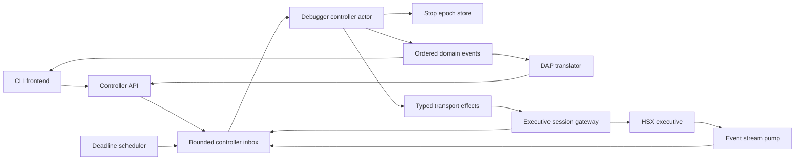
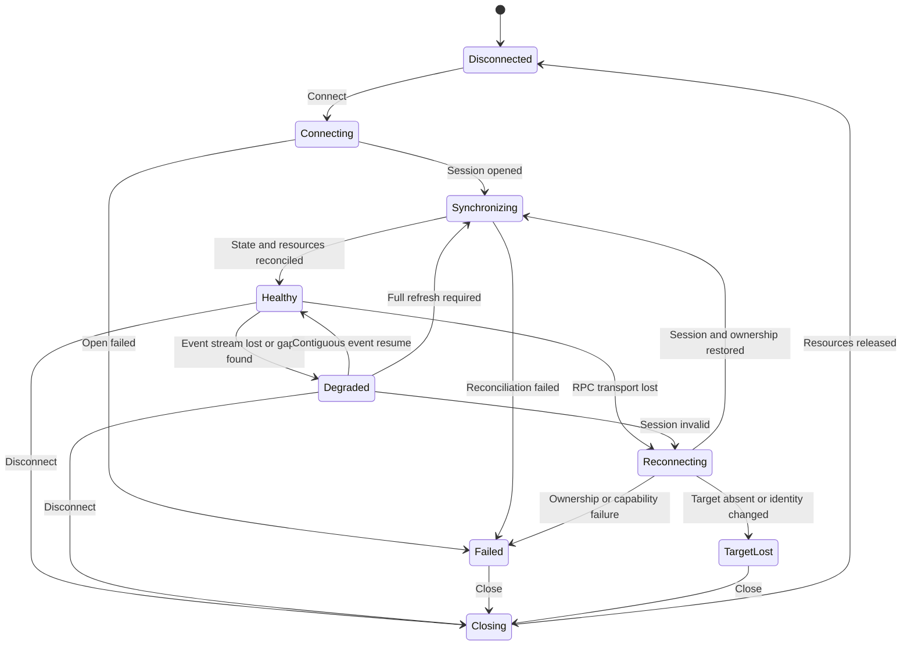
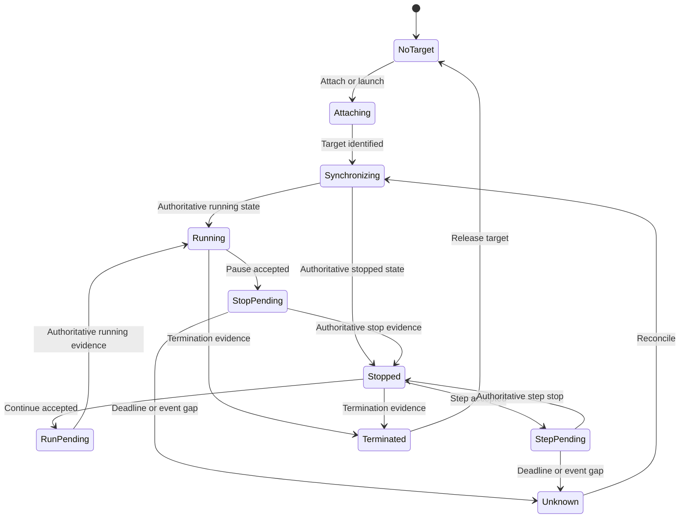
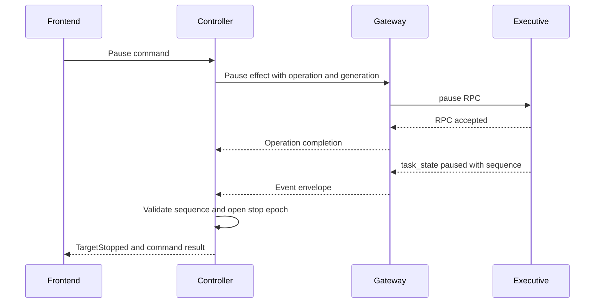

# DBG-ST-002 — Controller, State, Concurrency, Events, and Recovery

- Status: **COMPLETE FOR MASTER SYNTHESIS**
- Date: 2026-08-19
- DesignAnalysis: `DBG-DA-001`
- Iteration: `DBG-IT-001-002`
- Owning issue: #38
- Evidence baseline: `codex/dbg-da-001` activation head
  `ea2b53728de5abfe9e9482560390bd1a2de6c9d2`

## Question and scope

Which frontend-neutral controller, state machine, stop-epoch, concurrency, event-authority,
transport-health, reconnect, and fallback model best satisfies `DBG-R-004`,
`DBG-R-007..DBG-R-013`, `DBG-R-020`, and `DBG-R-026..DBG-R-028`?

This Study compares three implementation models and recommends a target model for Master
synthesis. It does not accept an architecture, reserve stable `DBG-A-*` or `DBG-D-*` IDs, or
authorize product changes. DAP/VS Code presentation, detailed symbol/resource/stepping policy,
and structural implementation remain outside this worker's scope.

## Authority and method

The Study followed the repository startup order in `AGENTS.md`, including the active Debugger
`CurrentIndex`, issue #38 activation directive, accepted requirements, `DBG-ST-001`,
`DBG-CR-001`, `DBG-GAP-001`, `DBG-DA-001`, and the `DBG-IT-001-002` contract. Product code was
inspected read-only at the activation head.

Conclusions below are requirements-driven. Existing code is treated as implementation evidence
and a regression oracle, not as a required architecture.

## Evidence inspected

### Durable contracts and prior findings

- `SDP/Debugger/02--Study/001--Legacy_Debugger_Baseline.md`
- `SDP/Debugger/03--Requirements/001--Debugger_Requirements.md`
- `SDP/Debugger/CodeReview/001--Legacy_VSCode_Debugger/01--CodeReview.md`, especially
  `DBG-F-007..DBG-F-011`, `DBG-F-013`, `DBG-F-025`, and `DBG-F-026`
- `SDP/Debugger/GapAnalysis/001--Debugger_Stabilization/01--GapAnalysis.md`, especially
  `DBG-RF-002`, `DBG-RF-003`, and their dependency on `DBG-DA-001`
- `SDP/Debugger/05--DesignAnalysis/001--Optimal_Debugger_Architecture/README.md`
- `SDP/Debugger/Sprints/001--Debugger_Stabilization/ScrumIterations.md`, active
  `DBG-IT-001-002`
- issue #38, including Steering activation comment `5345600066` and Master activation record

### Current implementation

- `python/hsx_dbg/backend.py` — typed RPC records/helpers, session construction, attach identity,
  event-stream forwarding, and `debug.state` compatibility fallback
- `python/hsx_dbg/session.py` — frontend-shared connection configuration and backend lifetime
- `python/executive_session.py` — RPC retry, session negotiation, capability list, keepalive,
  event stream, buffering, callback, ACK, caching, and transport cleanup
- `python/hsx_dap/__init__.py` — DAP dispatcher/output, adapter state, connect/reconnect,
  event translation, task-state cache, stop suppression, pause/step timers, breakpoint polling,
  and frame/scope handle tables
- `docs/executive_protocol.md` — session/PID locks, capability negotiation, event sequences,
  resumable `since_seq`, back-pressure/drop warnings, task-state events, and inspection RPCs

### Tests

- `python/tests/test_hsx_dbg_backend.py`
- `python/tests/test_executive_session_helpers.py`
- `python/tests/test_hsx_dap_reconnect.py`
- `python/tests/test_hsx_dap_harness.py`
- `python/tests/test_hsx_dap_cli.py`
- `python/tests/test_executive_sessions.py`

The four focused unit/harness modules were run at the evidence baseline:

```text
c:/Users/hanse/miniconda3/python.exe -m pytest \
  python/tests/test_hsx_dbg_backend.py \
  python/tests/test_executive_session_helpers.py \
  python/tests/test_hsx_dap_reconnect.py \
  python/tests/test_hsx_dap_harness.py -q

51 passed in 0.64s
```

This is evidence that the current regression fixtures pass, not evidence that the identified
concurrency, event-loss, or reference-lifetime gaps are closed. The inspected tests do not
adversarially interleave DAP requests, event callbacks, timer callbacks, reconnect, and
shutdown; they do not verify event EOF/gap recovery or stable references across repeated
stack/scope requests.

## Observed current architecture

### Useful foundations

1. `DebuggerBackend` supplies useful typed records and a mostly narrow RPC vocabulary. The
   current `RegisterState`, `StackFrame`, and `WatchValue` types and many conversion helpers
   are reusable evidence for a transport-facing data boundary.
2. `DebuggerSession` captures the useful concept that one debugger session owns one backend
   connection configuration and attach mode.
3. `ExecutiveSession` already negotiates features and PID locks, sends keepalives, opens a
   dedicated event stream, tracks recent events, and retries RPC transport failures.
4. The executive protocol already specifies monotonic event sequences, ACKs, stream
   back-pressure, `since_seq`, `seq_evicted`, PID-lock ownership, and task-state reasons. Those
   are the right raw materials for designed recovery if their implemented semantics and
   capabilities are made explicit.

### Controller and identity remain missing

`DebuggerBackend` is a stateless-looking RPC facade plus `_session` and `_attached_pid`.
`DebuggerSession` stores `backend` and a reconnect configuration. Neither owns a debugger
lifecycle/run-state model or stop epochs. That policy remains in `HSXDebugAdapter`, which also
stores both `backend` and `client` aliases to the same object. This confirms `DBG-F-025` and
the core part of `DBG-F-026`: the shared package is not yet the sole stateful frontend API.

### Mutable state has several writers

The DAP request loop is sequential, but it is not the only mutation context:

- the request thread changes PID, connection, pending operations, thread state, resources,
  handles, and caches;
- `ExecutiveSession` invokes `_handle_exec_event` on its event-stream thread;
- pause, step, and remote-breakpoint `threading.Timer` callbacks mutate the same adapter;
- reconnect runs synchronously from whichever caller receives a backend error;
- event callbacks and timers call `DAPProtocol.send_event` directly.

No controller-wide lock or serialized input lane protects these transitions. `DAPProtocol`
locks only the final write, while allocating `seq` before the lock. This is the concrete basis
for `DBG-F-008` and `DBG-F-009`.

### Event and session health are not modeled

Observed behavior in `ExecutiveSession`:

- event EOF clears `_event_stream` internally, but no stream-lost notice reaches the adapter;
- the adapter's `_event_stream_active` can therefore remain true after the stream dies;
- malformed event JSON is skipped without a health transition;
- callback exceptions are swallowed, then the event can still contribute to a later ACK;
- ACK failures and keepalive failures are swallowed;
- the blocking event socket has no liveness signal while no events arrive;
- RPC connection loss triggers an internal retry/reopen policy, while the adapter has a second
  reconnect/reapply policy;
- stream subscription does not expose the documented `since_seq` recovery path, event gaps,
  `seq_evicted`, drops, or executive-instance identity to the adapter.

There is also a concrete re-entrancy hazard: the event worker sends ACKs via `request()`;
connection loss in that call enters session cleanup, whose stream cleanup can attempt to join
the event worker itself. The surrounding ACK handler swallows the resulting failure. The Study
does not claim a reproduced deadlock, but this path demonstrates why transport threads must not
own or hide debugger recovery transitions.

These observations support `DBG-F-010` and `DBG-F-011`. They also show that the protocol
documentation is ahead of the client implementation in resumable stream recovery.

### Runtime state has competing authorities

When events are accepted, the adapter still:

- polls remote breakpoints every five seconds;
- reads `ps` snapshots and a one-second task snapshot cache;
- emits synthetic pause completion after 0.3 seconds;
- emits synthetic step completion after 0.05 or 0.35 seconds;
- uses a 0.2-second `(reason, PC)` heuristic to suppress duplicate stops;
- emits `continued` immediately from a request and can emit another from a later task event;
- translates both `debug_break` and `task_state` into stop events without a common causal stop
  identifier.

Time elapsed is not proof that a target stopped. A cached or polled task state is not safely
ordered against a later executive event. The combination confirms `DBG-F-013` and does not
satisfy `DBG-R-009`, `DBG-R-010`, `DBG-R-013`, or `DBG-R-020`.

### Stop references are request-local, not stop-local

Every `stackTrace` clears `_frames` and resets IDs to 1. Every `scopes` request clears
`_scopes` and resets IDs to 1. `_resolve_frame` can fall back from an unknown frame ID to the
first current frame. A repeated request can therefore silently rebind an old numeric handle to
a different object. There is no stop epoch, immutable target snapshot, or stale-handle error.
This confirms `DBG-F-007` and violates `DBG-R-004`.

## Requirements and finding coverage

| Requirement | Findings/evidence | Design obligation derived by this Study |
|---|---|---|
| `DBG-R-004` | `DBG-F-007`; request-local frame/scope maps | One immutable stop epoch owns all target-snapshot handles; stale handles fail explicitly and are never rebound. |
| `DBG-R-007` | `DBG-F-008`, `DBG-F-013`, `DBG-F-025` | Exactly one debugger-controller owner mutates lifecycle, target, desired-resource, operation, and epoch state. |
| `DBG-R-008` | `DBG-F-008`, `DBG-F-009` | All commands, transport events, completions, health notices, and deadlines enter one serialized reducer; each frontend has one ordered output owner. |
| `DBG-R-009` | `DBG-F-010`, `DBG-F-013` | Negotiated reliable events are the runtime-state authority; snapshot reads reconcile but do not compete. |
| `DBG-R-010` | `DBG-F-013` | Fallback mode is selected by explicit capabilities/health, bounded, observable, and owned by the controller contract. |
| `DBG-R-011` | `DBG-F-010` | RPC and event-stream health are separate first-class state; recovery has explicit success and failure outcomes. |
| `DBG-R-012` | `DBG-F-011` | Parser, callback, queue, ACK, keepalive, and reducer failures carry actionable context and cannot disappear silently. |
| `DBG-R-013` | `DBG-F-013` | A healthy event-authoritative session performs no periodic task or breakpoint polling. |
| `DBG-R-020` | `DBG-F-013`; two event forms and heuristic deduplication | Stop/run reasons are typed domain data tied to an authoritative transition/sequence, not inferred from timeout or UI intent. |
| `DBG-R-026` | RPC calls currently leak upward | Only a session gateway speaks executive RPC; controller/frontends never mutate VM internals. |
| `DBG-R-027` | `DBG-F-025`, `DBG-F-026` | CLI and DAP use the same stateful controller command/query/event API. |
| `DBG-R-028` | DAP and session responsibility mixing | Controller policy, transport mechanics, epoch storage, inspection, resources, and frontend translation have explicit boundaries. |

## Controller model alternatives

### Alternative A — Serialized synchronous controller

One controller object exposes blocking methods. A re-entrant lock protects all state and each
caller executes the transition and its executive RPC synchronously.

Advantages:

- smallest conceptual step from the current synchronous backend;
- easy for the current CLI and DAP handlers to call;
- no explicit actor lifecycle or Future/result type is required.

Costs and risks:

- correctness depends on every callback, timer, frontend, and future feature acquiring the
  same lock in the same order;
- holding the state lock across blocking RPC can delay events and shutdown or deadlock with
  callbacks and transport cleanup;
- releasing the lock around RPC creates split transitions and stale completion races;
- slow frontend observers can accidentally block controller progress;
- deterministic testing still requires simulating thread interleavings.

Conclusion: feasible for a very small debugger, but rejected here. It does not remove enough
of the exact failure modes observed in `ExecutiveSession` and `HSXDebugAdapter`.

### Alternative B — Actor/command-queue controller

One controller actor owns mutable debugger state. Frontends submit typed commands. Transport
workers, event pumps, timers, and operation workers submit typed inputs to one bounded inbox.
Only the actor reducer changes state. Blocking executive I/O runs outside the actor and returns
an operation completion tagged with controller/session/target generation and operation ID.

Advantages:

- mechanically enforces a single writer rather than relying on broad lock discipline;
- accommodates synchronous CLI/DAP callers through Futures while the controller still
  processes executive events;
- turns timers into inert deadline messages rather than mutation threads;
- makes event ordering, stale completion rejection, recovery, and stop epochs explicit;
- permits pure reducer/model tests plus deterministic integration scheduling;
- provides a natural bounded-backpressure point and ordered domain-event stream.

Costs and risks:

- queue shutdown, saturation, cancellation, Future completion, and observer back-pressure
  become designed behavior;
- transport effects and correlation IDs are additional implementation concepts;
- ordering by queue arrival alone cannot establish executive causality, so remote sequence,
  generation, and operation evidence are still required;
- a blocking RPC must never execute on the actor thread.

Conclusion: **recommended for Master synthesis**. Its costs are bounded and testable, and it
directly satisfies the single-owner and serialization requirements.

### Alternative C — Fully asynchronous core

Make the controller, executive client, event stream, timers, inspection, and frontend API one
`asyncio` graph.

Advantages:

- efficient I/O multiplexing and cancellation primitives;
- natural representation of streaming events and command completion;
- potentially fewer operating-system threads.

Costs and risks:

- requires a broad rewrite of the blocking socket/session stack and synchronous CLI/DAP
  call sites before architecture value is demonstrated;
- event-loop ownership becomes a frontend/deployment question, especially when embedded by
  tests or extension wrappers;
- mutable async tasks still race unless all state transitions are routed through a single
  reducer or actor, so `async` alone does not satisfy `DBG-R-007..008`;
- cancellation and task failure can become another silent background-failure surface.

Conclusion: not recommended as the initial core model. An async transport or async facade may
be added later behind the same actor ports without changing state ownership.

## Recommended target model

### Boundary overview



The controller is a state owner and orchestrator, not a new monolith. It coordinates typed
ports to separate transport, epoch/inspection, resource, and frontend components.

### Thread and execution boundary

1. One controller thread consumes the inbox and invokes a pure or near-pure reducer.
2. Public API calls are thread-safe queue submissions returning `Future[Result]` or a typed
   command handle. A synchronous facade may wait on the Future outside the actor.
3. The actor never performs socket I/O, waits on a frontend, or writes DAP bytes.
4. A session gateway owns RPC/event socket mechanics. Its workers may parse frames and execute
   effects, but only enqueue immutable completions/events/health notices.
5. Timer callbacks only enqueue `DeadlineExpired`; they do not inspect or mutate state.
6. Domain events leave through an ordered dispatcher. A slow/failing subscriber is isolated
   by a bounded subscription queue and produces diagnostics rather than blocking the actor.
7. DAP output sequencing remains a DAP transport responsibility: one outbound writer assigns
   `seq` at wire-serialization time. The controller supplies ordered domain intent, not DAP
   protocol objects.

### State ownership

| State | Sole owner | Notes |
|---|---|---|
| Controller revision and lifecycle | Controller actor | Every accepted transition increments a local revision. |
| Connection/session generation | Controller actor | Changes on open/reopen; tags all effects and inputs. |
| RPC health and event-stream health | Controller actor from gateway notices | Kept separate so event loss cannot masquerade as healthy RPC. |
| Negotiated capability profile | Controller actor | Immutable within a session generation; changes require reconciliation. |
| Target identity, PID, ownership mode, target generation | Controller actor | PID alone is not sufficient proof of identity across reconnect. |
| Target run/stop state and stop reason | Controller actor | Derived only from authoritative evidence for the active generation. |
| Pending control operation | Controller actor | Contains operation ID, expected state, deadline, and generation. |
| Last applied executive event cursor | Controller actor | Per executive-instance/session stream; drives deduplication, gap detection, and resume. |
| Active stop epoch and target snapshot handles | Stop epoch store under actor mutation | Snapshot data is immutable after publication. |
| Desired breakpoint/watch aggregate | Dedicated resource policy component committed through actor lane | The controller owns authoritative composition/revision, not resource parsing/reconciliation algorithms. |
| DAP sequence and client handles | DAP transport/translation boundary | Never stored as debugger truth. Domain handles are mapped without reuse within their valid lifetime. |

No callback or frontend may receive a mutable reference to controller state. Published
snapshots and events are immutable copies tagged with controller revision.

## State machines

Connection/session health and target execution are related but orthogonal. Combining them in
one enum would create a large, ambiguous state product.

### Connection and recovery state



`Healthy` requires both acceptable RPC health and the event/fallback authority selected by
the negotiated profile. A connected TCP endpoint alone is not healthy.

### Target execution state



A command response means the command was accepted unless the executive contract explicitly
declares the response's returned state authoritative. It does not by itself justify a
fabricated `Stopped` transition after a local timer.

## Command, event, and effect model

### Input envelope

Every inbox item should carry enough provenance to reject stale work:

- local ingress ID and timestamp;
- controller/session/target generation as applicable;
- command or operation ID;
- executive instance/stream identity and remote `seq` for events;
- capability profile revision;
- deadline ID for timer messages;
- typed payload or typed failure.

Queue arrival order serializes local mutation but does not claim remote causality. The reducer
uses event sequence/generation and operation correlation to decide whether an input applies.

### Command categories

- session: connect, attach, launch, disconnect, close;
- target control: pause, continue, instruction/source step, terminate;
- inspection: acquire stack/frames/scopes/variables/registers/memory/disassembly for an epoch;
- desired resources: replace/set breakpoint or watch intent through the resource-policy port;
- recovery/operator: retry recovery, cancel operation, request health snapshot;
- queries: immutable controller snapshot, active epoch, capabilities, diagnostics.

Detailed lifecycle, stepping, and resource semantics remain inputs from `DBG-ST-003` and the
Master synthesis.

### Domain events

- `ControllerStateChanged`
- `SessionHealthChanged`
- `CapabilitiesChanged`
- `TargetAttached`, `TargetRunning`, `TargetStopped`, `TargetTerminated`, `TargetLost`
- `StopEpochOpened`, `StopEpochInvalidated`
- `OperationCompleted`, `OperationFailed`
- `InspectionInvalidated`, `ResourcesChanged`
- `OutputReceived`
- `DiagnosticRaised`

Each carries controller revision and relevant target/epoch/generation IDs. Frontends translate
these; they do not infer target truth from UI state.

### Normal pause interaction



The event may arrive before the RPC completion; correlation and target state, not callback
timing, determine completion. If the deadline arrives first, the controller enters
`Unknown`/`Degraded` and reconciles or fails the command. It does not emit a synthetic stop.

## Stop epoch and snapshot lifetime

### Definition

A stop epoch is an immutable identity for one target's continuous stopped interval, tied to:

- controller/session/target generation;
- stable target identity;
- the authoritative stop transition or reconciliation evidence;
- typed stop reason and source event cursor;
- a monotonically increasing local epoch ID;
- lazily materialized immutable inspection data.

### Lifetime rules

1. Open an epoch only from authoritative stopped-state evidence or a documented authoritative
   reconciliation snapshot.
2. Replayed/duplicate evidence for the same remote stop does not open another epoch.
3. Invalidate the epoch before committing continue/step/terminate, target replacement,
   disconnect, ownership loss, event gap that makes state uncertain, or a newer stop.
4. Handles encode or reference target generation, epoch ID, kind, and local immutable object
   ID. Numeric frontend handles may map to these but must not be reused for an unrelated object
   during the frontend session.
5. Frames, scopes, variables, and target-snapshot-dependent evaluate results resolve only
   against their owning active epoch. Unknown or stale handles return a typed `StaleEpoch` or
   `UnknownHandle`; they never fall back to another frame.
6. A lazy inspection completion tagged with an invalidated epoch is discarded and its caller
   receives `StaleEpoch`.
7. Source content references that are independent of runtime state may use a separate
   session/source-catalog lifetime. Their identity and invalidation rule must be explicit; they
   must not share the reusable stop-handle namespace.

### Snapshot consistency limit

Current inspection RPCs are PID-based and do not accept a stop token/revision. If another
owner can resume the target between stack/register/memory reads, the debugger cannot prove
that lazily collected data belongs to one stop. A portable executive capability should expose
either an atomic inspection snapshot or an expected target-stop token checked by inspection
RPCs. Until that dependency exists, the controller can require a known stopped owner state and
reject results after observed invalidation, but a residual race remains. This is an unresolved
cross-track dependency, not evidence the debugger may invent consistency.

## Event authority, capability profiles, and fallback

### Required capability profile

The broad current `events` feature is insufficient to select safe policy. The controller needs
an immutable negotiated profile covering at least:

- task-state events present and authoritative;
- executive-instance/stream identity;
- monotonic event sequence and ACK semantics;
- resume from `since_seq` and `seq_evicted` behavior;
- gap/drop/back-pressure notices;
- command-response state evidence;
- atomic or token-checked inspection snapshots;
- PID lock/reacquisition semantics;
- named/versioned compatibility aliases such as `step.mode`.

The gateway reports capabilities; it does not silently select debugger policy.

### Authority modes

| Mode | Entry condition | Runtime-state authority | Allowed fallback |
|---|---|---|---|
| Event resumable | Reliable task events and cursored resume negotiated | Contiguous applied events | No healthy polling; resume from last applied/ACK-safe cursor. |
| Event non-resumable | Reliable task events but no cursor resume | Events while healthy | On stream loss, enter degraded state, invalidate uncertain epoch, and perform one full reconciliation before returning healthy. |
| Poll-only compatibility | Event/task-state capability explicitly absent | One controller-owned snapshot poller | Bounded cadence, visible compatibility status, stop when disconnected, and version/removal condition. |
| Degraded recovery | Event gap, EOF, drop, callback failure, or session loss | None until resumed/reconciled | Bounded resubscribe/reopen attempts and explicit failure; no claim of healthy state. |

A one-time `ps` snapshot during attach/reconciliation is not competing polling. Periodic task
or breakpoint polling during healthy event mode is prohibited. Resource event capability and
fallback cadence must be defined by the owning resource design rather than retained as the
current unconditional five-second timer.

Timers establish a deadline, not target state. When pause/step evidence is late, the controller
reports pending/degraded state and requests authoritative reconciliation according to the
capability profile. It never creates a stop merely because 50, 200, or 350 milliseconds passed.

### Event application and ACK

- Apply events only for the current executive/session/target generation.
- Ignore exact duplicates; reject or buffer bounded out-of-order events according to the
  protocol contract.
- Detect a sequence gap before applying later state events.
- Advance the resumable cursor and ACK only after the controller has successfully applied or
  deliberately classified the event. A callback/reducer failure cannot be ACKed as processed.
- Queue saturation is a health failure. Stop ACK progress, surface diagnostics, and recover or
  fail according to bounded policy; never drop state events silently.
- Unknown event types are tolerated and recorded according to forward-compatibility policy;
  unknown values that affect state are not fabricated into known stop reasons.

## Reconnect and recovery outcomes

Recovery policy belongs to the controller; socket/session mechanics belong to the gateway.
Low-level retries, if retained, must be transport-safe, bounded, reported, and must not
silently create a new debugger session or ownership identity.

A recovered session is not `Healthy` until all required gates pass:

1. RPC transport and protocol version are compatible.
2. Session opens and capabilities are re-negotiated.
3. The same target identity is proven; PID equality alone is insufficient after restart/reuse.
4. Required owner lock is reacquired, or the explicitly requested observer mode is restored.
5. Event stream resumes contiguously, or a full reconciliation barrier completes.
6. Desired breakpoint/watch state is reconciled by its owner without adopting external state.
7. Target run/stop state is authoritative and any active epoch is retained only if continuity
   was proven; otherwise it is invalidated and a new epoch is opened if stopped.

Explicit outcomes:

| Outcome | Controller effect |
|---|---|
| Same target, lock and contiguous cursor restored | Return to healthy state without duplicate transitions; retain epoch only if stop continuity is proven. |
| Same target, event history evicted | Invalidate epoch, full state/resource reconcile, then publish a new coherent state. |
| Target absent or stable identity differs | `TargetLost`; fail pending operations and do not attach silently to reused PID. |
| Owner lock cannot be reacquired | `OwnershipLost`/`Failed`; do not silently downgrade to observer. |
| Required capability regressed | `IncompatibleSession` or an explicitly designed degraded profile; no hidden compatibility path. |
| Protocol version mismatch | Terminal `Failed` until operator/configuration action. |
| Recovery budget exhausted | `Failed` with attempts, last error, and retained diagnostic context. |
| Operator disconnect during recovery | Cancel recovery, close resources, complete pending commands as cancelled. |

## Controller invariants

1. Exactly one actor context mutates debugger state.
2. Every state transition increments controller revision and produces at most one ordered
   domain-event batch.
3. No frontend, callback, timer, gateway worker, or DAP writer owns target truth.
4. Every asynchronous completion is generation/operation tagged; stale completions cannot
   mutate current state.
5. At most one conflicting target-control operation is active per target. Invalid transitions
   fail before effects are issued.
6. Event sequence continuity is checked before state mutation and ACK.
7. One active stop epoch exists at most per target; it is invalidated before execution can
   proceed or continuity becomes uncertain.
8. A handle never resolves outside its owning lifetime and is never silently rebound.
9. `Healthy` event mode performs no periodic state/breakpoint polling.
10. A deadline can fail or reconcile an operation but cannot fabricate target state.
11. Reconnect cannot become healthy until target identity, ownership, capabilities, events,
    resources, and state are reconciled.
12. Exceptions from parsing, event application, effects, subscribers, keepalive, and cleanup
    are observable with operation/session/target context.
13. Frontends manipulate runtime only through controller commands and the executive gateway;
    neither controller nor frontend embeds VM implementation logic.
14. Shutdown has one idempotent path, rejects new commands, cancels deadlines/effects, resolves
    all pending Futures, and joins workers without self-join or lock inversion.

## Responsibilities and non-responsibilities

| Component | Responsibilities | Explicit non-responsibilities |
|---|---|---|
| `DebuggerController` actor | Authoritative lifecycle/health/target state, operation orchestration, authority mode, stop reason, epochs, recovery policy, ordered domain events | Socket framing, JSON parsing, DAP messages, symbol parsing, breakpoint algorithms, IDE/UI state, VM internals |
| Controller reducer/model | Validate typed inputs, enforce transitions/invariants, produce new immutable state/effects/events | I/O, sleeps, locks, frontend callbacks |
| Stop epoch store | Epoch identity, immutable snapshot objects, handle allocation/validation/invalidation | Fetching RPC data, symbol/address interpretation, DAP numeric IDs |
| Executive session gateway | JSON/TCP/session/event mechanics, feature negotiation, PID lock request, keepalive, ACK, cursor subscription, typed RPC effects, typed health notices | Debugger lifecycle truth, automatic policy-level reconnect, resource adoption, frontend events |
| Deadline scheduler | Schedule/cancel IDs and enqueue expiry inputs | State mutation, synthetic completion, retry decisions |
| Resource policy port | Desired/observed ownership and reconciliation model committed through controller lane | Transport sockets, DAP presentation, lifecycle authority |
| Inspection service port | Resolve symbols/source/address and produce epoch-tagged immutable inspection data | Stop lifetime policy, target control, frontend handle reuse |
| Frontend translator | Convert frontend requests to controller commands and domain events/results to frontend protocol | Reconnect, target truth, stop deduplication, resource ownership, direct executive RPC |
| Frontend transport writer | Frame and serialize one protocol stream, assign wire sequence at write order | Debugger state/policy |

This split enforces the anti-monolith rule while preserving a single authoritative composition
root.

## Candidate frontend-neutral API

Names are illustrative; Master and later accepted Design own the exact API.

```text
Controller.start() -> None
Controller.submit(command: DebuggerCommand) -> Future[CommandResult]
Controller.snapshot() -> Future[ControllerSnapshot]
Controller.subscribe(filter: EventFilter) -> ControllerSubscription
Controller.close() -> Future[CloseResult]
```

Candidate command/value types:

| Type | Essential fields/result |
|---|---|
| `Connect` | endpoint, requested capability profile, recovery policy |
| `Attach` | target selector, owner/observer mode, expected stable identity |
| `Launch` | launch specification and ownership policy |
| `Pause`, `Continue`, `Step`, `Terminate` | target handle, operation kind, optional expected controller revision |
| `InspectStack` | active epoch handle, range/limit; returns immutable frame handles |
| `InspectScopes`, `InspectVariables` | owning epoch/frame/scope handle; explicit stale error |
| `SetDesiredBreakpoints`, `SetDesiredWatches` | client/resource owner identity and replacement/reconciliation intent |
| `Disconnect` | explicit target/session effect policy |
| `RetryRecovery`, `CancelOperation` | operation/session generation and bounded policy |
| `ControllerSnapshot` | revision, connection/target state, health, capabilities, active epoch, pending operations, diagnostics summary |

All errors are typed (`InvalidTransition`, `SessionUnavailable`, `TargetLost`,
`OwnershipLost`, `CapabilityUnavailable`, `OperationTimeout`, `StaleEpoch`, `UnknownHandle`,
`RecoveryFailed`, `Cancelled`) rather than inferred by parsing arbitrary strings. Raw executive
errors remain available as diagnostic causes at the gateway boundary.

## Failure semantics

| Failure | Required behavior |
|---|---|
| RPC timeout/loss | Gateway emits typed completion and health notice; controller marks pending operation and enters bounded recovery or fails it. |
| Event EOF/socket error | Immediate event-health transition; no stale active flag and no continued healthy claim. |
| Malformed event/callback/reducer failure | Contextual diagnostic; do not ACK past unapplied state; degrade/fail according to severity. |
| Event gap/drop/back-pressure | Stop normal application at the gap, surface counters/cursor, resume or full reconcile. |
| Controller inbox/subscriber queue full | Observable saturation policy; protect state events and stop ACK progress rather than silently dropping. |
| Stale operation/timer after reconnect | Ignore for mutation, resolve/cancel its Future once, and record at debug level. |
| Invalid state command | Fail before executive effect; state remains unchanged. |
| Stale inspection handle | Typed stale error; never return current-frame data under an old handle. |
| Target resumes externally | Invalidate epoch on authoritative event; in-flight inspection results are rejected. |
| Keepalive/session expiry | Health transition and ownership reconciliation; no silent retry that claims the old lock. |
| Shutdown | Idempotent cancellation and bounded worker join; no silent exceptions. |

## Domain reuse/adapt/replace input

This is a controller-domain input to `DBG-ST-005` and Master, not the final cross-system
reuse/adapt/replace matrix.

| Current component/behavior | Posture | Evidence and target use |
|---|---|---|
| `DebuggerBackend` typed records and RPC methods | **Adapt** | Preserve useful types/conversions, but make it a gateway/port implementation with typed errors/capabilities and no hidden policy reconnect. |
| `DebuggerSession` connection-owner concept | **Adapt concept, replace state shape** | Keep explicit one-session ownership; remove duplicate adapter/backend/client identity and place session generation under controller authority. |
| `ExecutiveSession` JSON/RPC/session/keepalive/event mechanics | **Adapt substantially** | Retain proven protocol mechanics/helpers where safe; add health notices, cursor resume, gap/drop handling, ACK-after-apply, cancellation, and observable errors; remove swallowed policy failures and hidden session-state transitions. |
| `ExecutiveSession` stack/capability helper caches | **Adapt or move** | Capability decoding belongs in gateway profile; target inspection cache belongs to epoch/inspection ownership, not transport-global time cache. |
| `HSXDebugAdapter` controller/lifecycle fields | **Replace** | Move PID, connection, target state, pending control, epochs, resources, and recovery to shared controller. |
| `backend`/`client` aliases | **Remove** | One controller-to-gateway identity replaces split aliases. |
| `_frames`, `_scopes`, reusable integer tables and frame fallback | **Replace** | Epoch-scoped immutable handles with explicit stale/unknown failure. |
| pause/step synthetic fallback timers | **Replace** | Deadline messages plus authoritative reconcile/failure; no fabricated stop. |
| unconditional remote breakpoint timer and mixed task cache/poll | **Replace** | Capability-selected event authority or one bounded compatibility poller owned by core/resource contracts. |
| `(reason, PC, 0.2 s)` duplicate-stop suppression | **Replace** | Executive sequence/stop identity and reducer idempotence. |
| DAP protocol final write lock | **Adapt** | Create one outbound writer that assigns sequence inside serialization order; keep outside controller. |
| Current unit/harness tests | **Reuse and extend** | Valuable oracle for typed RPC, attach, reconnect, stack/scopes, events, and stepping, but add model/concurrency/health/epoch coverage before removing old behavior. |

## Migration obligations

No step below is authorized by this Study. If Steering later accepts the architecture, a safe
sequence is:

1. Freeze regression behavior and add failing or golden tests for repeated frame/scope
   requests, event loss, reconnect outcomes, concurrent inputs, and no-poll healthy idle.
2. Introduce immutable state, command/event/effect types, pure reducer, and stop-epoch store
   beside the legacy adapter without changing the production path.
3. Freeze the `DBG-RF-002` controller to `DBG-RF-003` gateway interface: capabilities,
   operation completions, transport event envelopes, health notices, cursor/ACK contract, and
   generation rules.
4. Adapt `ExecutiveSession` behind the gateway and verify event EOF, gaps, resume, ACK,
   keepalive, shutdown, and recovery mechanics independently.
5. Run the actor behind a compatibility facade and migrate one end-to-end vertical control
   path before moving the rest of lifecycle/inspection/resource behavior.
6. Make both CLI and DAP consume the same controller API/domain events. Keep frontend protocol
   mapping and output writers separate.
7. Remove adapter-owned state, synthetic timers, alias identity, direct RPC, caches, and polling
   only after parity and adversarial tests pass at the production entrypoint.
8. Retain the legacy debugger as oracle until the owning Refactors and cross-platform
   verification receive exact-head sign-off.

Suggested structural ownership after an accepted design:

- `DBG-RF-002`: actor/controller, reducer, authoritative state, operation correlation,
  stop-epoch store, and frontend-neutral API;
- `DBG-RF-003`: gateway transport mechanics, explicit health/capability/cursor contract,
  bounded low-level recovery primitives, and integration with `DBG-RF-002`;
- `DBG-RF-004..006`: epoch-safe inspection, resource, and lifecycle/step policy through frozen
  controller ports;
- `DBG-RF-007`: thin DAP translation and one outbound serializer;
- `DBG-RF-009`: adversarial/product-path/cross-platform convergence evidence.

`DBG-RF-002` and `DBG-RF-003` may only proceed in parallel after their shared envelopes,
generation rules, health states, and recovery ownership are frozen. Their first integration
Slice must prove the complete command/effect/event/result path.

## Verification obligations for later contracts

### Pure model and epoch tests

- transition table coverage for valid and invalid state commands;
- every transition preserves the invariants and monotonically increases revision;
- duplicate/out-of-order/stale generation inputs are deterministic;
- repeated stack/scope requests preserve prior epoch handles;
- resume/new stop/reconnect uncertainty invalidates exactly the intended handles;
- unknown handles never fall back to another frame;
- late inspection completions cannot populate a new epoch.

### Concurrency and queue tests

- adversarial schedules of frontend commands, executive events, operation completions,
  deadlines, reconnect, and shutdown;
- instrumentation proves controller mutation occurs on one actor context;
- blocked RPC does not block event application;
- stale completion and timer messages after reconnect have no state effect;
- inbox/subscriber saturation has observable, bounded behavior;
- repeated start/stop/reconnect has no self-join, orphan thread, or unresolved Future.

### Event/session health tests

- clean EOF, reset, half-open detection policy, malformed JSON, callback/reducer exception,
  ACK failure, keepalive failure, sequence duplicate/gap, `event_dropped`, slow consumer,
  `seq_evicted`, and executive restart/sequence reset;
- ACK never advances beyond an event not applied by the controller;
- healthy event-capable idle produces zero periodic task/breakpoint polls;
- poll-only mode occurs only under the negotiated compatibility profile and respects cadence,
  backoff, visibility, and cancellation bounds.

### Reconnect outcome tests

- same target retained with contiguous cursor;
- same target retained after evicted history/full reconcile;
- target missing, PID reused, owner lock lost, observer restored, capability regression,
  incompatible protocol, resource reconcile failure, and exhausted retry budget;
- active epoch is retained only with proven continuity and otherwise invalidated;
- no frontend reports connected/healthy before the reconciliation barrier.

### Stop-reason and frontend-contract tests

- pause, breakpoint, instruction/source step, mailbox wait/timeout, sleep, fault,
  termination, and unknown future reasons map once and consistently;
- the same remote stop represented by multiple related events produces one domain stop;
- ordered domain events allow a DAP writer to preserve response/event and sequence order;
- CLI and DAP observe equivalent controller results for the same scripted evidence.

## Unresolved evidence and cross-track questions

These are not design choices this Study can safely invent:

1. **Stable target identity:** what executive identifier distinguishes a continuing target from
   a reused PID across executive restart/reconnect?
2. **Executive stream identity:** event `seq` is documented as monotonic per executive process,
   but the client needs an instance/boot/stream generation to distinguish reset from replay.
3. **Resume implementation:** `docs/executive_protocol.md` specifies `since_seq` and
   `seq_evicted`; the inspected `ExecutiveSession` does not expose them. Which server behavior
   is implemented and how is it negotiated?
4. **Authoritative command response:** do pause/resume/step responses carry a state revision or
   stop token that may complete a transition, or are task-state events the only authority?
5. **Atomic inspection:** can stack/register/memory/disassembly reads be tied to one stop token
   or returned as one immutable snapshot?
6. **Event causality:** can `debug_break` and its related `task_state` share a transition/stop ID
   so deduplication does not use timing heuristics?
7. **Health detection:** what heartbeat or read deadline distinguishes a healthy idle event
   stream from a silent half-open socket without violating no-poll healthy idle?
8. **Ownership recovery:** what exact server semantics apply when a former owner attempts to
   reacquire a lock, and can observer downgrade ever be explicit rather than failure?
9. **Capability granularity/versioning:** which event, cursor, resource-event, state-response,
   and compatibility capabilities need separate names and removal conditions?
10. **External resume race:** can an observer or another permitted actor change target state
    while epoch reads are in flight, and what server-side revision check rejects stale reads?
11. **Controller deployment:** the API should be reused by CLI and DAP; whether both can share
    one in-process controller instance or normally run separate controller sessions remains a
    packaging/ownership decision.
12. **Queue budgets:** expected event burst rate, inspection latency, and shutdown budget are
    needed to set bounded inbox/subscriber capacities and recovery timing.

## Proposed architecture/design concepts for Master allocation

The following are proposed concepts only. The Master should reconcile them with
`DBG-ST-003..DBG-ST-005`, assign stable numbered IDs, and keep them proposed until Steering
acceptance.

### Proposed `DBG-A-*` concepts

- **Serialized debugger-controller authority:** one actor/reducer is the sole lifecycle,
  target-state, operation, and stop-epoch mutation owner used by every frontend.
- **Controller/gateway separation:** recovery policy and debugger truth belong to the
  controller; executive protocol, sockets, session negotiation, and health evidence belong to
  a typed gateway.
- **Epoch-safe inspection boundary:** target-dependent inspection is immutable and bound to a
  stop epoch; symbol/resource/frontend modules consume handles and cannot extend their lifetime.
- **Capability-selected event authority:** healthy reliable events are primary; fallback,
  resumption, and reconciliation are explicit modes, not simultaneous competing truth.
- **Ordered domain-event/frontend boundary:** the controller publishes frontend-neutral events;
  each frontend owns only translation and its protocol output serialization.

### Proposed `DBG-D-*` contract concepts

- controller command/event/effect envelopes, generation tags, Futures, bounded queues, and
  shutdown semantics;
- orthogonal connection-health and target-execution state machines with transition table and
  typed failure outcomes;
- stop-epoch creation/invalidation, immutable snapshot, handle encoding/mapping, and stale
  result rules;
- gateway capability profile, event sequence/gap/ACK/cursor contract, and observable health
  notices;
- reconnect budget and reconciliation barrier with explicit retained/lost/ownership/capability
  outcomes;
- capability-driven poll-only mode and deadline behavior, including the prohibition on
  synthetic target transitions;
- ordered domain-event subscription and frontend back-pressure isolation;
- controller/gateway and controller/inspection/resource port contracts used to freeze
  `DBG-RF-002..DBG-RF-007` dependencies.

## Conclusions

### Evidence-supported conclusions

1. The current shared backend/session layers are useful transport foundations but are not an
   authoritative debugger controller.
2. The current adapter has concurrent state writers and competing event/poll/cache/timer truth;
   incremental lock or timer fixes would retain the underlying architectural gap.
3. Event-stream and keepalive failure are not first-class observable state, and the documented
   cursor/gap recovery behavior is not consumed by the current client.
4. Current frame/scope references cannot meet `DBG-R-004` without a stop-epoch lifetime model.
5. An actor/command-queue controller with nonblocking typed transport effects best satisfies
   `DBG-R-004`, `DBG-R-007..013`, `DBG-R-020`, and `DBG-R-026..028` while remaining usable from
   synchronous frontends.
6. A fully async rewrite is unnecessary to obtain serialization and would expand migration
   risk; async mechanics can remain behind ports.
7. Recovery is complete only after identity, ownership, capabilities, events, resources, and
   target state reconcile. Reopening a socket is insufficient.
8. Timers may expire operations but may not fabricate stopped/running state.

### Unresolved conclusions reserved for Master/Steering

- Exact stable `DBG-A-*` / `DBG-D-*` allocation and module names.
- Final controller API composition with inspection/resource/lifecycle results from the other
  Studies.
- Portable executive changes needed for target identity, stream identity, stop tokens,
  inspection consistency, and event causality.
- Whether any compatibility poll-only profile is retained for Debugger 1.0 and its versioned
  removal condition.
- Concrete queue/retry/deadline budgets and controller deployment topology.

## Traceability and handoff

This Study provides evidence and a recommendation to `DBG-DA-001`. It refines the boundary
between `DBG-RF-002` and `DBG-RF-003`, and supplies controller contracts consumed by
`DBG-RF-004..DBG-RF-007` and verification obligations for `DBG-RF-009`.

No product code, test, runtime, extension, shared traceability, issue, or implementation
authority was changed. Master must synthesize this Study with `DBG-ST-003..DBG-ST-005`, obtain
fresh exact-head architecture review, and stop at issue #38 Steering acceptance.
