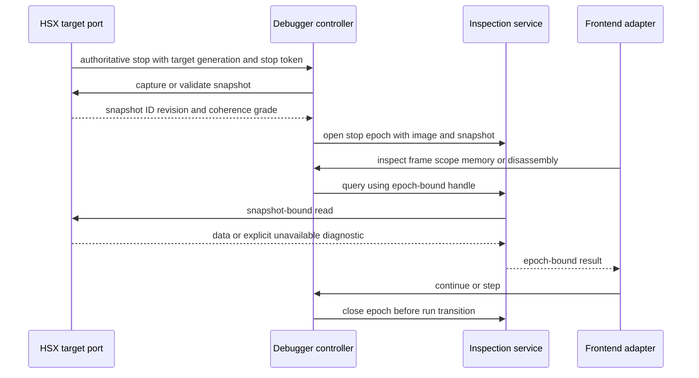
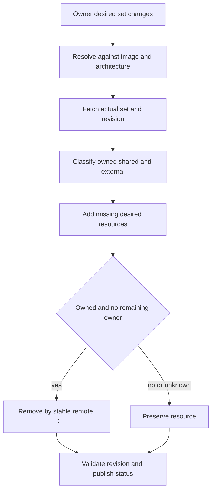
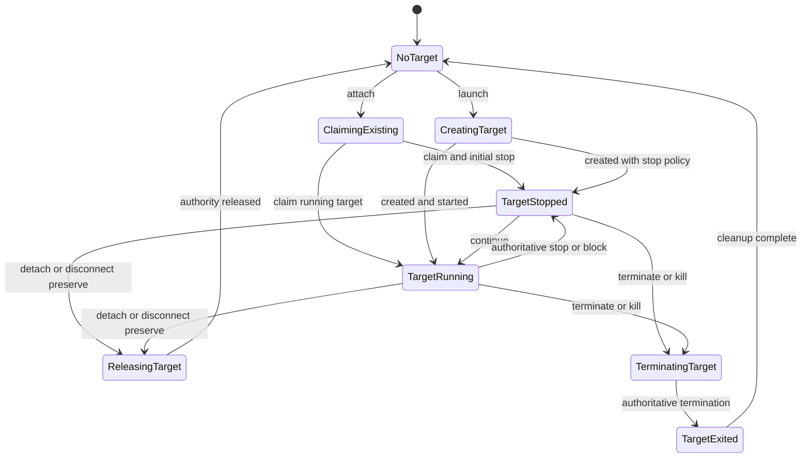
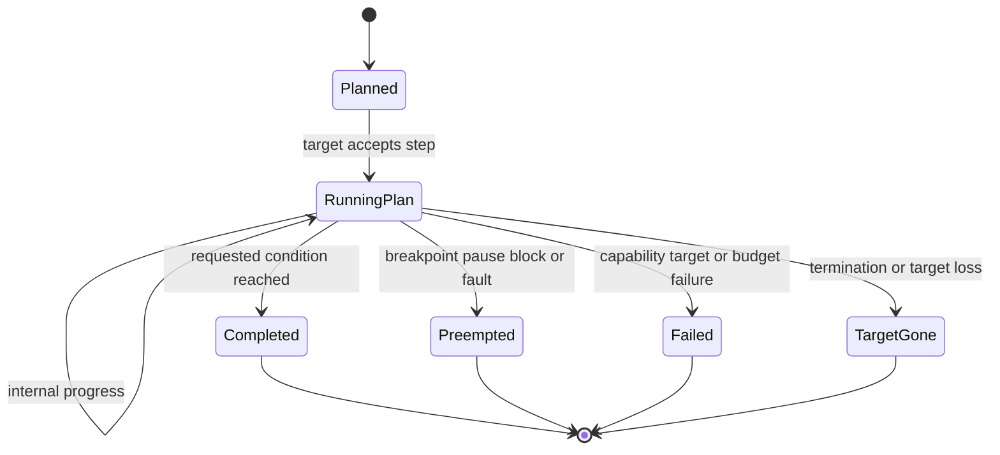

# DBG-ST-003 — Inspection, Resources, Lifecycle, and Execution Semantics

- Status: COMPLETE FOR MASTER SYNTHESIS
- Date: 2026-08-19
- Evidence baseline: `codex/dbg-da-001` at
  `ea2b53728de5abfe9e9482560390bd1a2de6c9d2`
- DesignAnalysis: `DBG-DA-001`
- Iteration: `DBG-IT-001-002`
- Owning issue: #38; Steering start directive: issue comment `5345600066`

## Question and scope

Which model best satisfies symbol/source/address/inspection fidelity, multi-client
breakpoint/watch ownership, explicit target lifecycle, distinct instruction/source stepping,
and truthful stop reasons across `DBG-R-005..DBG-R-006`, `DBG-R-014..DBG-R-030`, and
`DBG-R-036`?

This Study covers the debugger-core semantics that a single authoritative controller must
invoke. It does not create a competing controller/state machine; `DBG-ST-002` and the Master
synthesis own that integration. It also does not define DAP or VS Code presentation structure,
which belongs to `DBG-ST-004`.

## Guard and non-goals

- No product, runtime, extension, test, or packaging file is changed by this Study.
- No structural Refactor is authorized.
- Candidate architecture/design concepts below are proposals for Master synthesis, not
  accepted `DBG-A-*` or `DBG-D-*` records. Numeric IDs are deliberately left to the Master.
- The Debugger track does not invent portable HSX address widths, address spaces, ABI unwind
  rules, instruction retirement, target identity, or runtime snapshot semantics. Missing
  contracts are recorded as dependencies on `HSX-ST-001` and future HSX requirements/designs.
- Legacy documents are evidence only where current code/tests corroborate them; they are not
  silently promoted to normative contracts.

## Traceability focus

| Evidence/finding | Requirements examined | Primary downstream owner |
|---|---|---|
| `DBG-F-004` identical into/over/out | `DBG-R-016..DBG-R-020`, `DBG-R-027..DBG-R-028`, `DBG-R-030`, `DBG-R-036` | `DBG-RF-006` |
| `DBG-F-005` launch equals attach | `DBG-R-005..DBG-R-006`, `DBG-R-020`, `DBG-R-026..DBG-R-030`, `DBG-R-036` | `DBG-RF-006` |
| `DBG-F-006` terminate only pauses | `DBG-R-006`, `DBG-R-020`, `DBG-R-026..DBG-R-030`, `DBG-R-036` | `DBG-RF-006` |
| `DBG-F-007` unsafe frame/scope lifetimes | `DBG-R-004`, `DBG-R-021..DBG-R-025`, `DBG-R-027..DBG-R-030`, `DBG-R-036` | `DBG-RF-002`, `DBG-RF-004` |
| `DBG-F-012` external watch adoption | `DBG-R-015`, `DBG-R-022`, `DBG-R-025`, `DBG-R-027..DBG-R-028`, `DBG-R-036` | `DBG-RF-005` |
| `DBG-F-014` DAP-owned breakpoint policy | `DBG-R-014`, `DBG-R-023..DBG-R-025`, `DBG-R-027..DBG-R-030`, `DBG-R-036` | `DBG-RF-005`, `DBG-RF-007` |
| `DBG-F-019` hard-coded address width | `DBG-R-016`, `DBG-R-021..DBG-R-026`, `DBG-R-028`, `DBG-R-036` | `DBG-RF-004` plus HSX dependency |
| `DBG-F-020` globally lowercased source identity | `DBG-R-017..DBG-R-019`, `DBG-R-021`, `DBG-R-024..DBG-R-025`, `DBG-R-028`, `DBG-R-036` | `DBG-RF-004` |
| `DBG-F-026` core is not sole frontend API | `DBG-R-005..DBG-R-006`, `DBG-R-014..DBG-R-030`, `DBG-R-036` | `DBG-RF-002..DBG-RF-007` |

`DBG-R-029` is relevant here only as a boundary: IDE views may render these domain results but
must not own snapshot, lifecycle, resource, or execution truth. `DBG-R-030` requires the
standard stack/variables/watch/breakpoint/step surfaces to work from the shared contracts
before an HSX-specific view is needed.

## Evidence inspected

### Durable SDP and coordination evidence

- `AGENTS.md`, `SDP/README.md`, `SDP/Shared/Process.md`;
- `SDP/Debugger/README.md` and `SDP/Debugger/Traceability/CurrentIndex.yaml`;
- issue #38 body and all three comments through Master activation comment `5345697295`;
- `DBG-ST-001`, accepted `DBG-R-001..DBG-R-036`, `DBG-CR-001`, accepted
  `DBG-GAP-001`, active `DBG-DA-001`, `DBG-IT-001-002`, and the current Handoff;
- `SDP/HSX/Traceability/CurrentIndex.yaml` and planned `HSX-ST-001`, which explicitly names
  portable address and execution semantics required by `DBG-R-023` and
  `DBG-R-016..DBG-R-020` as unresolved migration work.

### Product and protocol evidence, read-only

- `python/hsx_dbg/symbols.py`, `backend.py`, `session.py`, `context.py`, and the attach,
  detach, observer, execution-control, breakpoint, watch, stack, symbols, memory, and
  disassembly CLI command modules;
- `python/hsx_dap/__init__.py`, including lifecycle, stepping, stack/scopes/variables,
  source/memory/disassembly, breakpoint/watch reconciliation, reconnect, stop-event, and
  symbol-resolution paths;
- `python/executive_session.py`, especially session negotiation, typed helpers, event
  streaming, retry, and stream-worker behavior;
- debugger-facing `python/execd.py` session locks, breakpoints, symbols, locals/watches,
  memory regions, stack walking, stepping, state events, pause/resume/kill, and dispatch;
- debugger-facing `platforms/python/host_vm.py` MiniVM/VMController breakpoint, debug-stop,
  instruction-step, attach/detach, register, memory, and target-task behavior;
- `docs/executive_protocol.md`, `docs/hsx_spec-v2.md`, `docs/symbol_format.md`,
  `docs/sources_json.md`, `docs/portable_debug_workflow.md`, `python/source_map.py`, and
  relevant legacy debugger/VM/executive designs.

### Test and fixture evidence

- `python/tests/test_hsx_dbg_symbols.py`, `test_hsx_dbg_backend.py`,
  `test_hsx_dap_harness.py`, `test_hsx_dap_reconnect.py`, `test_debugger_basic.py`,
  `test_executive_session_helpers.py`, `test_executive_sessions.py`,
  `test_hsx_llc_debug.py`, `test_source_map.py`, and `dap_stubs.py`;
- `python/tests/fixtures/sample_debug.sym` and `breakpoints_golden.json`.

Read-only confirmation run at the evidence head, with bytecode and pytest cache disabled:

```text
c:/Users/hanse/miniconda3/python.exe -m pytest -p no:cacheprovider \
  python/tests/test_hsx_dbg_symbols.py \
  python/tests/test_hsx_dbg_backend.py \
  python/tests/test_hsx_dap_harness.py \
  python/tests/test_hsx_dap_reconnect.py \
  python/tests/test_debugger_basic.py \
  python/tests/test_executive_session_helpers.py \
  python/tests/test_executive_sessions.py -q

118 passed in 0.95s
```

The PASS confirms the described legacy behavior; it does not prove the target architecture or
close any requirement gaps.

## Findings from the current implementation

### S3-F01 — The symbol pipeline contains useful parsing, but identity is lossy

`SymbolIndex` centralizes instruction-to-source, source-to-address, name, locals, and globals
indexes, which is valuable reuse evidence. However:

- `_canonical_path()` globally lowercases paths;
- PCs and function/label/variable addresses are masked with `0xFFFF`;
- `lookup_pc()` masks the query to `0xFFFF`;
- basename aliases can collide without returning an ambiguity diagnostic;
- DAP source-breakpoint resolution takes the first candidate even when a line maps to several
  addresses;
- the executive independently parses a second symbol representation and its `by_name` map
  retains only one entry per name.

`docs/symbol_format.md` already defines version `1`, `hxe_crc`, relocated byte addresses,
instruction mappings, and memory regions. The debugger does not currently use the HXE CRC as
an image/symbol compatibility gate. This is the direct evidence behind `DBG-F-019` and
`DBG-F-020` and risks violating `DBG-R-023..DBG-R-025`.

### S3-F02 — A portable source-map implementation exists but the debugger bypasses it

`python/source_map.py` and `sources.json` support prefix maps, project-relative identity,
relocation search roots, and case-preserving POSIX separators. Their tests cover current-root,
relocated-root, symlink, and reverse prefix-map resolution. In contrast, `SymbolIndex` and the
DAP adapter use lowercased string keys, basename fallback, workspace/repository heuristics, and
direct `Path.resolve()` calls.

The source-map code is a strong adaptation seed, but it currently returns the first matching
candidate and lacks an explicit ambiguity/result type. Filesystem resolution must remain
separate from stable build-artifact source identity.

### S3-F03 — Inspection is assembled from independent live reads, not one snapshot

The DAP adapter requests stack frames, registers, watches, memory, symbol data, and
disassembly through separate RPCs. The executive stack walker starts with a register read and
then reads frame words from task memory. Locals and watches perform further current-register
and current-memory reads. No common target revision or snapshot token appears in these APIs.

Useful behavior exists: the executive stack walker checks bounds/alignment/cycles, returns
`truncated` plus explicit `errors`, and annotates frames with symbols/lines. Yet a target can
change between any two reads, so the current interfaces cannot prove that stack, locals,
registers, memory, and disassembly describe one stopped state as required by
`DBG-R-021..DBG-R-025`.

### S3-F04 — Frame, scope, and variable references are not stop-epoch safe

Each DAP `stackTrace` clears `_frames` and restarts IDs at `1`; each `scopes` request clears
all `_scopes` and restarts those IDs at `1`. `_resolve_frame()` silently falls back to the
first cached frame for an unknown frame ID. A stale request can therefore be rebound to an
unrelated frame or return variables assembled from newer live state. Existing harness tests
verify happy-path stack/register/watch formatting but do not exercise overlapping requests,
stale references, or a resume between inspection calls.

This confirms `DBG-F-007`. The fix must share the stop-epoch contract owned by the controller;
renumbering DAP handles alone is insufficient.

### S3-F05 — Address handling is internally inconsistent

`DebuggerBackend.list_breakpoints()` deliberately preserves 32-bit values and has a regression
test for high addresses. DAP memory, disassembly, and formatting commonly use 32-bit masks.
At the same time, `SymbolIndex`, CLI breakpoint resolution/context IDs, executive breakpoint
storage/comparison, executive memory-watch resolution, VM memory/code access, and VM
breakpoints mask to 16 bits. `TaskContext.pc`, stack pointers, registers, and much symbol
metadata are represented as 32-bit values.

This Study cannot decide whether those masks are correct for HSX generally, target-specific,
or accidental. A typed address-space descriptor is required from the HSX track before
`DBG-RF-004` can remove or retain masks correctly.

### S3-F06 — Stack and local inspection embeds ABI assumptions without a portable contract

The executive stack walker assumes R7 is the frame pointer and `[prev_fp, return_pc]` occupies
eight bytes at `fp`. It correctly surfaces partial-walk errors and tests cover two frames, an
FP cycle, and a read failure. Local-variable evaluation supports PC-ranged stack, register,
global, and constant locations, but DAP-side local resolution uses a simpler first-location
model and frame FP/SP fallback.

The implementation is useful evidence and a Python oracle, not a portable ABI contract. Frame
pointer role, stack growth/ranges, return-address meaning, call-site adjustment, endianness,
location-list boundaries, and optimized/no-frame-pointer behavior must be supplied by HSX
architecture/debug-metadata contracts.

### S3-F07 — Breakpoints are remote address sets without owner or stable identity

The executive and VM expose a per-PID set of masked addresses. Session PID locks restrict who
may mutate a target while a lock exists, but breakpoint records do not carry resource ID,
owner/session, origin, requested specification, image generation, or revision. When no lock
exists, `ensure_pid_access()` allows mutation, so an observer/no-lock session is read-only only
because current frontend commands voluntarily block mutations. On session close the lock is
released, while the resource set is not attributed or reconciled by owner.

The DAP adapter compensates with source/function/instruction dictionaries, pending specs,
readonly entries inferred from remote address differences, a five-second remote poll,
reapply logic, and temporary clear/restore at the current PC. These mechanisms cannot
distinguish two owners at the same address. `clearAllBreakpoints` intentionally force-clears
entries inferred as external. A frontend `setBreakpoints` replacement can also clear the
effective address needed by another owner.

This confirms `DBG-F-014`. Address-only reconciliation cannot fully satisfy `DBG-R-014` after
reconnect; it needs remote provenance or a deliberately conservative degraded mode.

### S3-F08 — Watches are target-global records without provenance, and events can transfer ownership

The executive stores watches globally under `watchers[pid][watch_id]`; mutation requires the
PID lock, but list/event records contain no creator/session/owner generation. Watch changes are
checked after guest steps and emitted by integer watch ID. Session close does not remove
watches by owner; task kill clears all.

The DAP adapter records watch IDs that it creates, but `watch_update` also populates those same
maps with `setdefault()` for any observed watch. Shutdown then deletes every mapped ID. This is
the exact `DBG-F-012` failure: observation becomes ownership. Reconnect restoration is based on
expressions, with no proof that a remote ID still belongs to the same frontend.

There is also an important semantic split currently hidden under one term:

- a standard debugger watch expression is evaluated against a selected stopped frame/snapshot;
- an executive live watch is a persistent remote sampling resource that may emit while the
  task runs.

Frame-relative local expressions should not become indefinite remote resources merely because
the frontend used a Watch UI.

### S3-F09 — Launch, attach, disconnect, terminate, and target identity are ambiguous

The DAP `attach` handler calls the `launch` handler. `launch` requires an existing PID and
only opens/configures a locked or observer session; it does not load or create a target.
`disconnect` disables debug state, emits `terminated`, cleans up, and closes the session.
`terminate` disables debug state, pauses the target, emits `terminated`, then performs the same
cleanup; it never calls the executive `kill` operation that actually removes a task.

The CLI also has a separate legacy global `attach`/`detach` concept in addition to session PID
locks, while `DebuggerSession.attach()` means configuring a lock. Observer mode is not a
protocol-enforced capability: a no-lock session can issue target mutations unless its frontend
prevents them. A bare PID is cached across reconnect without an
executive-instance/target-generation identity. PID reuse or executive restart can therefore
rebind a cached target unintentionally.

These facts confirm `DBG-F-005`, `DBG-F-006`, and the lifecycle part of `DBG-F-026`.

### S3-F10 — Instruction step exists, but source-step operations are not distinct

The backend sends either `step` or `step` with `source_only`. The executive implements
`source_only` by repeatedly retiring instructions while debug metadata labels the reported PC
as compiler-generated. The test oracle confirms that this skips compiler entries and falls
back to one instruction without metadata.

All DAP `next`, `stepIn`, and `stepOut` handlers invoke the identical
`step(source_only=True)` operation. No requested step kind, origin frame, source-location
range, return target, step-plan identity, or cancellation reason reaches the core/runtime.
Instruction stepping additionally relies on debug-state toggling. Current resume behavior
contains a one-shot breakpoint bypass, while the DAP's explicit legacy step fallback
clear/restores every breakpoint at the current PC. The latter can temporarily remove an
external client's stop condition; neither arrangement is yet the portable typed step contract.

This confirms `DBG-F-004` and does not satisfy `DBG-R-017..DBG-R-019`.

### S3-F11 — Stop reason and task run state are conflated

Current events expose useful raw facts (`task_state`, `debug_break`, mailbox wait/wake/timeout,
sleep request/complete, VM debug stops), but the DAP adapter mixes them with locally generated
pause/step timers and duplicate suppression based on `(reason, pc, 0.2 seconds)`.

Paused, stopped, mailbox-waiting, and sleeping task states are all treated as DAP-stoppable.
Mailbox timeout is translated to running. Source-step completion is synthesized as generic
`step`, even though no source-step distinction exists. Termination is sometimes a DAP event
generated by closing the frontend rather than evidence that the target terminated.

A task's runtime state (`running`, blocked on mailbox, sleeping, paused, terminated) must be
separate from the causal debugger stop (`user_pause`, breakpoint, requested step, fault). A
timeout/wake is a transition cause, not automatically a stopped cause. This distinction is
required for `DBG-R-020` and for truthful standard DAP behavior under `DBG-R-030`.

### S3-F12 — Tests are valuable behavioral oracles but omit the unsafe boundaries

Current tests preserve important behavior:

- source/function/instruction breakpoint mapping and an external-breakpoint display path;
- reconnect reapplication;
- stack diagnostics and register/watch formatting;
- local stack/register watches;
- instruction-step and source-only compiler skipping;
- VM breakpoint/BRK/async-break reasons;
- session PID-lock conflicts and release;
- symbol/source relocation helpers.

The suite does not currently prove stop-epoch handle stability, coherent multi-read snapshots,
case-sensitive same-name paths, symbol/image identity, multi-owner collision and disconnect,
PID generation safety, distinct source into/over/out, actual target termination, or stop-reason
precedence. Those gaps must be filled before structural replacement under `DBG-R-036`.

## Alternatives considered

### Inspection and symbols

| Option | Benefits | Failure/risk | Decision |
|---|---|---|---|
| Keep live per-request reads and only stop recycling DAP IDs | Small change | IDs become stable labels over incoherent registers/memory; cannot meet `DBG-R-022`/`025` | Reject |
| Cache all inspection data in the frontend on each stop | Can improve legacy behavior without runtime change | Expensive, duplicates core policy, and cannot prove atomicity without a runtime revision | Compatibility mechanism only |
| Immutable stop snapshot plus versioned debug-artifact/source services | One coherence boundary for every frontend and view; explicit partial/unavailable results | Requires new controller and HSX executive contracts | Recommend |

### Source identity

| Option | Benefits | Failure/risk | Decision |
|---|---|---|---|
| Lowercase normalized path plus basename fallback | Simple on common Windows trees | Collides on case-sensitive filesystems and loses artifact identity | Reject |
| Host filesystem canonical path as identity | Better local correctness | Breaks relocation/remote builds and can vary by host | Use only as a resolved display location |
| Case-preserving build-artifact ID plus `sources.json`/user mappings | Stable across relocation and can report ambiguity | Needs versioned artifact binding and richer resolution result | Recommend |

### Breakpoint/watch ownership

| Option | Benefits | Failure/risk | Decision |
|---|---|---|---|
| Each frontend clears/recreates the PID-global set | Simple | Deletes other clients' resources; already demonstrated unsafe | Reject |
| Core-only local desired/actual map over address-only RPC | Frontends converge; conservative cleanup is possible | Cannot prove ownership after reconnect or address collision | Required compatibility mode |
| Stable remote resource IDs, owner tokens, target generation, and revisions | Correct multi-client convergence and reconnect | Requires executive protocol capability | Recommend target contract |

### Lifecycle

| Option | Benefits | Failure/risk | Decision |
|---|---|---|---|
| Preserve launch-as-attach and terminate-as-pause | No migration | UI promises remain false; ownership cannot be reasoned about | Reject |
| Explicit core lifecycle over current independent RPC sequence | Establishes frontend parity quickly | Load-then-lock and reconnect can race without target generation/atomic claim | Compatibility path only |
| Explicit lifecycle plus atomic executive target create/claim/kill/detach contracts | Truthful ownership and recovery | Requires HSX protocol work | Recommend |

### Source stepping

| Option | Benefits | Failure/risk | Decision |
|---|---|---|---|
| Keep one `source_only` flag for into/over/out | Existing behavior/tests | Semantically wrong for calls and returns | Reject |
| Implement independent stepping loops in CLI and DAP | Can ship locally | Repeats `DBG-F-026` and diverges between frontends | Reject |
| Shared bounded core step planner using typed target primitives | One semantic owner; works with incremental target capabilities | Compatibility loop may be slow and needs reliable stop/snapshot/unwind contracts | Recommend |
| Make source stepping an opaque executive-only policy | Potentially efficient | Moves source/symbol policy across the boundary and can diverge by target | Optional optimized primitive only after the shared semantic contract is fixed |

## Recommended target model

### Domain identities and value types

These are semantic types, not prescribed Python class names.

| Type | Required content | Purpose |
|---|---|---|
| `TargetId` | executive instance ID, PID, target generation | Prevent PID/restart aliasing |
| `ImageId` | HXE identity including validated CRC/build ID and load generation | Bind symbols/source to the running image |
| `Address` | address-space ID plus unsigned value | Eliminate implicit code/data/host-pointer mixing |
| `ArchitectureDescriptor` | named spaces, widths, range/mask rules, byte order, instruction alignment | Supply all legal address operations from HSX |
| `SourceArtifactId` | image/compilation-unit identity plus case-preserving debug path or stable file ID | Separate source identity from local path |
| `SourceLocation` | artifact ID, line, column/discriminator, executable address set/ranges | Drive source breakpoints and stepping |
| `StopEpochId` | target ID plus monotonic controller epoch and upstream stop token/revision | Own inspection/reference lifetime |
| `SnapshotId` | stop epoch plus target snapshot/revision and coherence grade | Bind all reads to one state |
| `FrameId` | snapshot ID plus stable unwind-frame key/index | Prevent cross-epoch frame rebinding |
| `OwnerId` | debugger controller/frontend instance plus connection generation | Model desired resource provenance |
| `LogicalResourceId` | stable debugger-side breakpoint/watch identity | Decouple user intent from remote addresses/IDs |
| `RemoteResourceId` | target ID, remote stable ID, remote owner token, resource generation/revision | Reconcile safely |
| `StepPlanId` | target/owner plus requested kind and origin epoch | Correlate completion/cancellation |

No layer may apply a numeric mask directly to `Address`; only the
`ArchitectureDescriptor` validates/normalizes a value for a named target space.

### Symbol and source contracts

Recommend one immutable `DebugArtifactIndex` per `ImageId`:

- parse a versioned `.sym` artifact once and validate its `hxe_crc`/image identity;
- preserve every symbol candidate rather than overwriting duplicate names;
- index instructions by typed code address and source locations by stable
  `SourceArtifactId`;
- return `resolved`, `unavailable`, or `ambiguous` results with candidate evidence;
- expose function ranges, instruction/source classification, variable location lists,
  memory regions, and diagnostics without reading live target state;
- never own lifecycle, target transport, resource reconciliation, or frontend handles.

Recommend a separate `SourceResolver`:

1. match stable source artifact/file identity and recorded checksum when available;
2. apply the versioned `sources.json` prefix map;
3. apply explicit user workspace mappings/search roots;
4. compare filesystem case according to the actual filesystem policy while preserving the
   original spelling;
5. reject basename collisions as ambiguous rather than silently selecting one;
6. return both stable identity and resolved local display path.

`python/source_map.py` is the preferred adaptation seed. Global lowercasing in
`SymbolIndex`/DAP is not retained.

### Stop-snapshot inspection contract

Every accepted stop establishes one immutable inspection epoch. This is coordinated with the
controller proposal from `DBG-ST-002`:



Required behavior:

1. A stop is accepted only for the current `TargetId` and ordered transition token.
2. The controller opens a new epoch and binds the matching `ImageId`/artifact.
3. Registers, stack, locals/globals, watches, memory, and disassembly use the same
   `SnapshotId` or explicitly declare immutable-code data.
4. Frame/scope/variable/source handles include the epoch; unknown or stale handles return
   `stale_reference`, never a fallback frame.
5. Stack reconstruction returns partial frames plus diagnostics, as the current executive
   walker usefully does. It never invents a caller.
6. Variable resolution chooses the location-list entry live for the selected frame PC and
   evaluates it against that frame/snapshot, not the newest current frame.
7. Continue/step/terminate closes the epoch before target execution. Already-issued results
   may finish against the immutable snapshot; new queries fail as stale according to the
   frozen controller policy.
8. Unavailable architecture, unwind, memory, or symbol data is explicit and does not silently
   reuse cached values from another epoch.

Compatibility mode is allowed only if observable and bounded:

- while the target remains paused, read a target revision before and after the inspection
  batch;
- accept the batch only if the revision and target generation are unchanged;
- otherwise retry at most the designed bounded count or return `snapshot_changed`;
- if the executive exposes no revision/snapshot capability, label results `best_effort` and
  do not claim full `DBG-R-022`/`DBG-R-025` conformance.

### Breakpoint/watch desired-versus-actual model

One frontend-neutral `ResourceReconciler` owns logical resources. Frontends submit desired
sets scoped by `OwnerId`; they never mutate the remote PID-global set directly.

For breakpoints, one logical request retains its source/function/instruction specification,
artifact binding, enabled state, owner set, resolved typed addresses, verification/ambiguity
diagnostics, and zero or more remote identities. Several logical resources may intentionally
share one effective remote address.

For watches, distinguish:

- `SnapshotExpression`: a standard frame/snapshot expression reevaluated on each stop and not
  installed as a persistent executive resource;
- `LiveWatchResource`: an explicit remote sampling/watchpoint-like resource with owner,
  lifetime, remote ID, and events.

A frame-relative local is normally a `SnapshotExpression`. If a product feature later needs a
live local watch, it must define frame-exit/rebinding behavior explicitly.

Reconciliation algorithm:

1. Serialize mutation through the controller and capture target/resource revision.
2. Resolve desired specs against the current `ImageId`; keep unresolved requests with
   diagnostics instead of guessing.
3. Fetch the remote actual set with stable IDs, owner tokens, target generation, and revision
   when supported.
4. Compute the union required by all owners; add missing effective resources.
5. Remove an actual resource only when the controller can prove it owns that remote resource
   and no desired owner still needs it.
6. Preserve every external/unknown resource, including same-address collisions.
7. Apply mutations conditionally on revision; refetch and retry on conflict within a bounded
   policy.
8. Publish logical verification state and external observations without transferring
   ownership.



Address-only legacy compatibility is necessarily conservative:

- remember only IDs/addresses created and confirmed by this controller in the current
  `TargetId`/connection generation;
- never adopt a resource because it appeared in a list or event;
- never remove an unknown/external resource during normal owner cleanup;
- when an external and owned logical resource share an address, leave the remote address set
  on owner removal unless provenance proves safe deletion;
- surface degraded reconciliation instead of claiming convergence;
- keep an explicit administrative “clear all target resources” operation separate from DAP
  owner-scoped replacement and require deliberate authorization.

This compatibility policy prevents current destructive behavior but cannot complete
`DBG-R-014..DBG-R-015` across arbitrary reconnect. Stable executive provenance remains a
cross-track dependency.

### Explicit lifecycle semantics

The shared core exposes distinct intents; DAP and CLI map to them without redefining effects:

| Intent | Core semantic | Default target effect |
|---|---|---|
| `attach(target, exclusive)` | Claim an existing `TargetId`; record `attached_existing` ownership | Preserve target; acquire exclusive debug authority |
| `attach(target, observer)` | Observe an existing target without mutation authority | Preserve target; no run/resource mutations |
| `launch(spec)` | Create/load a new target and claim the returned generation atomically | Record `launched_by_session`; start/stop-on-entry only as explicitly configured |
| `detach(policy)` | Release debug authority/resources owned by the session | Preserve target; resume or retain stopped state only according to explicit policy |
| `disconnect(policy)` | End frontend/core connection after applying the recorded ownership policy | Attached target defaults to detach/preserve; launched target follows explicit terminate/preserve choice |
| `terminate()` | Request actual executive target termination and await authoritative confirmation | Kill/remove the owned target; never substitute pause |
| `kill()` | Administrative force-termination where supported | Explicit destructive target removal |

`disconnect` is not itself evidence that the target terminated, so a DAP `terminated` event
must reflect target termination, not merely adapter shutdown. Any automatic target cleanup is
derived from recorded launch ownership and configuration such as `terminateDebuggee`, not the
frontend command name alone.

The lifecycle semantic view to be integrated into the single controller is:



Reconnect must validate executive instance ID, target generation, session/lock state, and
launch ownership before restoring resources. A matching bare PID is insufficient.

### Execution and stepping contracts

The controller accepts one typed request:

```text
StepRequest {
  target_id,
  origin_stop_epoch,
  kind: instruction | source_into | source_over | source_out,
  thread_or_pid,
  granularity,
  bounded_budget,
}
```

All steps require a current stopped epoch and mutation authority. The controller closes that
epoch, creates a `StepPlanId`, and allows exactly one plan per target according to the state
contract. User pause, disconnect, target loss, or another run command cancels the plan
explicitly.

#### Instruction step

- Invoke the HSX exact-one-instruction primitive for the selected PID.
- A breakpoint at the origin PC is bypassed once by runtime/run-control token, not by deleting
  the shared breakpoint.
- Completion carries before/after PC, retired count, target generation, and authoritative stop
  token. Normal completion requires the HSX-defined retired count; a fault, termination, or
  independently active breakpoint is reported with its real cause instead.
- No local timer may fabricate completion.

#### Source step into

Starting from the origin frame and executable `SourceLocation`, advance via exact instruction
steps or a semantically equivalent negotiated target primitive until the first distinct
user-source location is reached. A deeper callee frame is eligible, so calls are entered when
source/unwind information permits. Compiler-generated/unmapped prologue instructions may be
traversed only under an explicit bounded mapping policy.

#### Source step over

Record the origin frame identity/caller relationship and source range. Stop at the first
distinct user-source location in the same logical frame, or at the caller if the origin frame
returns. Deeper callee frames are traversed without being reported as step completion. An
independent breakpoint, user pause, block, fault, or termination still stops immediately with
its own cause.

#### Source step out

Record the origin frame identity and caller. Continue until the origin frame disappears and
the caller is the selected top frame at a valid source location. Recursion must be distinguished
by frame identity rather than function name or stack depth alone. An independent stop condition
preempts the plan.

For every source kind:

- internal temporary conditions belong to `StepPlanId` and go through the resource
  reconciler; they never clear an external/shared breakpoint;
- if an internal condition shares an address with an independently active user breakpoint,
  the user breakpoint reason wins;
- missing/ambiguous source or unwind data produces an explicit `source_step_unavailable` or
  bounded `step_incomplete`; it does not silently relabel one instruction as over/out;
- iteration/instruction/time budgets are bounded and observable;
- the semantic owner is the shared core. A future executive optimized step-plan RPC may
  implement the primitive, but must return the same typed completion/stop contract.



### Run state and stop-reason model

Keep two orthogonal fields:

- `TargetRunState`: disconnected, running, paused, blocked-mailbox, sleeping, terminated,
  unavailable;
- `TransitionCause`: user-pause, breakpoint, instruction-step, source-step-into,
  source-step-over, source-step-out, mailbox-wait, sleep, fault, exception, entry,
  target-terminated, target-lost, or explicitly versioned extension.

Only a transition into an inspection-stable non-running state has a `StopCause`, drawn from the
appropriate subset of `TransitionCause`. An authoritative stopped record contains target
generation, ordered event/transition token, stop epoch, PC/address space where available,
causal resource/step-plan ID, raw runtime reason, and structured details. Mapping rules include:

| Runtime evidence | Canonical result |
|---|---|
| confirmed user pause | `paused` plus `user-pause` |
| hit effective breakpoint | `paused` plus `breakpoint`, with all matching logical IDs/provenance |
| exact instruction plan completion | `paused` plus `instruction-step` |
| source plan condition reached | `paused` plus the requested into/over/out cause |
| mailbox wait | `blocked-mailbox` plus `mailbox-wait` only if the state is inspection-stable |
| mailbox wake/timeout | transition from blocked with wake/timeout detail; not a fabricated stop by itself |
| sleep request | `sleeping` plus `sleep` only if the state is inspection-stable |
| VM/runtime fault | `paused` or terminated as reported, plus `fault` and structured fault data |
| confirmed task removal/kill/exit | `terminated`; terminal event, not a reusable stopped epoch |
| RPC/event loss with target unverified | `unavailable` plus `target-lost`/connection-health evidence, never “still stopped” |

Reason precedence is causal, not time-based duplicate suppression. Independent user/external
breakpoints, pause, block, fault, termination, and target loss preempt a step plan. Duplicate
events are rejected by target generation plus ordered stop/transition identity, not a
`0.2`-second `(reason, pc)` heuristic.

## Responsibility and API boundaries

| Proposed block | Responsibilities | Explicit non-responsibilities | Owns mutable state/concurrency |
|---|---|---|---|
| Controller integration from `DBG-ST-002` | Serialize lifecycle/run/stop commands and events; own active target/epoch/plan | Symbol parsing, DAP formatting, executive wire details | Sole serialized mutation owner |
| `TargetSessionPort` | Typed executive capability/lifecycle/run/snapshot/resource calls; normalize versioned RPC responses | Frontend semantics, desired resource policy, source resolution | Connection/capability health only |
| `DebugArtifactIndex` | Immutable validated symbol/instruction/location/memory-region indexes per image | Live memory, target state, source filesystem selection | Immutable/cache by `ImageId` |
| `SourceResolver` | Map stable artifact source identity to a local path with ambiguity diagnostics | Symbol parsing, target reads, UI navigation commands | Immutable maps plus explicit user mapping updates through controller |
| `InspectionService` | Snapshot-bound registers/stack/variables/memory/disassembly and partial diagnostics | Run control, transport retries, DAP handles, resource mutation | Immutable per stop epoch |
| `ResourceReconciler` | Desired/actual logical breakpoint/live-watch ownership, provenance, conditional diff | Symbol parsing beyond typed resolution service; frontend presentation | All resource state mutated on controller queue |
| `LifecyclePolicy` | Attach/launch/detach/disconnect/terminate ownership/effects | RPC transport and DAP request spelling | Policy records owned by controller |
| `ExecutionPlanner` | Compile/advance/cancel typed instruction/source step plans and classify completion | DAP events, executive wire fallback selection, symbol-file parsing | One plan per target, controller-serialized |
| DAP and CLI frontends | Validate/map user protocol to core calls; render core results | Lifecycle truth, stepping algorithm, resource ownership, live target inspection | Frontend request/handle state only |

Frontend APIs should be command/result/event contracts over these types, not raw executive
dictionaries. This directly supports `DBG-R-026..DBG-R-030`: runtime control remains
executive-only, core policy is shared, modules are bounded, IDE state is presentation-only,
and standard DAP surfaces receive sufficient data without custom views.

## Debugger-owned versus HSX-owned contracts

### Debugger track owns

- frontend-neutral lifecycle intent and recorded target ownership policy;
- logical breakpoint/watch desired state, frontend owner scoping, conservative reconciliation,
  and standard-vs-live watch distinction;
- stop-epoch/reference lifetime and rejection of stale handles;
- debug-artifact indexing, source identity/resolution, ambiguity diagnostics, and matching an
  accepted HSX image identity;
- inspection composition and explicit partial/unavailable results;
- source into/over/out algorithms, step-plan lifecycle, budgets, preemption, and canonical
  debugger-visible reason mapping;
- CLI/DAP parity and regression-oracle tests.

### Missing portable HSX cross-track contracts

`HSX-ST-001` or later HSX requirements/designs must supply, without this Study guessing:

1. named code/data/register address spaces, widths, legal ranges/masking, byte order,
   instruction alignment and address serialization;
2. executive instance ID, PID generation/target identity, image load identity, and HXE
   build/CRC binding;
3. exact instruction-step retirement semantics and a one-shot bypass/step primitive that does
   not delete shared breakpoints;
4. authoritative ordered stop/run/block/fault/termination events, stop token/revision, retired
   count, PC, and target generation;
5. atomic snapshot reads or a stable stopped revision against which registers, memory, stack,
   and resource reads can be validated;
6. portable ABI/unwind/frame metadata, call/return interpretation, stack bounds/growth, and
   variable location-list semantics;
7. atomic or generation-safe create/load-and-claim, attach/lock, protocol-enforced
   observer-versus-mutator authority, release, and kill operations;
8. stable breakpoint/watch remote identity, owner/provenance token, conditional resource
   revision, and capability/version discovery—or an explicit declaration that only degraded
   conservative reconciliation is possible.

Until those contracts are accepted, `DBG-RF-004` and complete `DBG-RF-006` conformance remain
blocked even if debugger-local modules can be prepared.

## Domain reuse/adapt/replace recommendations

The Master-owned full reuse matrix will combine this evidence with `DBG-ST-005`. For this
domain:

| Current component/behavior | Posture | Evidence and required change |
|---|---|---|
| `python/hsx_dbg/symbols.py::SymbolIndex` | Adapt/extract | Preserve parsing/index concepts; replace masks/lowercase/basename guessing, validate image/schema, return typed ambiguity/results |
| `python/source_map.py::SourceMap` | Adapt/reuse | Preserve prefix-map/relocation behavior; add stable artifact identity, version checks, ambiguity and filesystem-case policy |
| `DebuggerBackend` register/stack/watch data classes and typed calls | Adapt | Useful DTO/helper seed; add `TargetId`, typed addresses, capabilities, snapshot/revision and explicit result errors; do not retain it as policy owner |
| `ExecutiveSession` symbol/stack/watch/disasm helpers | Adapt behind `TargetSessionPort` | Preserve capability/version fallbacks as named compatibility behavior; eliminate raw frontend RPC leakage |
| executive symbol parser/stack diagnostics | Reuse as compatibility oracle; adapt where HSX contracts accept it | Preserve partial stack diagnostics and location-list evidence; do not canonize R7/16-bit assumptions in Debugger |
| executive/VM PID-global breakpoint set | Replace protocol model, retain as legacy transport mode | Cannot express owner/provenance/revision; conservative compatibility only |
| executive watches | Adapt protocol/model | Preserve live sampling capability; add owner/stable identity/revision and keep snapshot expressions out of remote ownership |
| DAP frame/scope/reference tables | Replace with epoch-bound handle registry | Current recycling and fallback violate `DBG-R-004`/`DBG-R-022` |
| DAP breakpoint/watch policy and timers | Move/replace with shared core services | Preserve behavior through tests, not module layout; no observation-to-ownership transition |
| DAP lifecycle/step handlers | Replace policy with thin typed mapping | Preserve instruction-step behavior; launch/attach/terminate and source-step semantics intentionally change to accepted contracts |
| CLI breakpoint/watch/stack/control commands | Adapt to thin core client | Preserve command UX/aliases where compatible; remove independent masks, caches, IDs, and raw RPC policy |
| current DAP/executive/VM tests and fixtures | Reuse and extend as regression oracle | Keep golden symbol/breakpoint, stack diagnostics, live-watch, lock, reconnect, and instruction-step cases; add missing preservation tests below |

## Preservation and acceptance tests required before responsibility moves

### Artifact, address, source, and inspection

- `.sym` version/image CRC match and mismatch; duplicate symbol names return candidates;
- architecture descriptors with at least two address widths/spaces, proving no scattered
  mask decides behavior;
- two Linux files that differ only by case remain distinct; Windows resolution follows actual
  filesystem policy while preserving spelling;
- relocated `sources.json`, symlink, prefix map, user override, missing source, and ambiguous
  basename;
- one stop epoch serves stack/register/local/global/watch/memory/disassembly from one snapshot;
- repeated `stackTrace`/`scopes` calls keep earlier handles valid within the epoch;
- resume/new stop makes old handles fail as stale and never rebound;
- partial/no-frame-pointer stack produces explicit diagnostics and no invented frames;
- location lists choose by selected frame PC; selected non-top-frame local reads use that frame;
- concurrent frontend inspection requests receive deterministic epoch-bound results.

### Multi-client resources

- DAP plus CLI owners request distinct and same-address breakpoints, then one disconnects;
- source/function/instruction logical breakpoints resolve to several addresses without losing
  logical identity;
- an external breakpoint appears/disappears during reconciliation and is never adopted or
  deleted by observation;
- reconnect with retained target restores only desired owner resources; target generation
  change refuses stale reconciliation;
- optimistic revision conflict refetches/retries boundedly;
- standard snapshot watch expressions never create persistent remote watches;
- two live-watch owners share or separate resources, one disconnects, and the survivor remains;
- external `watch_update` never changes local ownership; task kill invalidates all cleanly;
- legacy address-only/ID-only mode demonstrates conservative preservation and reports degraded
  ownership rather than false convergence.

### Lifecycle, execution, and reasons

- attach exclusive versus observer, lock conflict, reconnect to same generation, and PID reuse;
- launch creates/claims a new target and records ownership; attach never creates one;
- disconnect preserve/detach and configured terminate behaviors; terminate proves actual target
  removal, not pause;
- exact instruction step at ordinary PC, current breakpoint, BRK, fault, and target exit;
- source into across a mapped call and unmapped/compiler prologue;
- source over across nested calls, recursion, same-line multiple instructions, loop backedge,
  and caller return;
- source out from nested/recursive frames and unavailable unwind metadata;
- user/external breakpoint at an internal step condition wins reason precedence;
- pause, breakpoint, each step kind, mailbox wait/wake/timeout, sleep/wake, fault,
  termination, event loss, and reconnect map to ordered canonical state/reason evidence;
- no timer-created stop and no time-window duplicate suppression in the authoritative path;
- CLI and DAP issue the same core intents and observe equivalent results.

## Risks and migration constraints

- Atomic snapshots, target generations, and remote resource provenance may require HSX
  executive/VM protocol work before full Debugger requirements can pass.
- Keeping 16-bit compatibility masks while introducing typed addresses can hide truncation if
  conversion is implicit. Compatibility adapters must validate and report overflow.
- Reconstructing frames client-side can be expensive; server-side unwind is acceptable only
  behind the same snapshot/ABI contract.
- Repeated-instruction source stepping is correct only with ordered stop evidence, stable frame
  reconstruction, and bounded plans. Performance optimizations must not change semantics.
- Internal step conditions and user breakpoints can share addresses. Resource ownership and
  reason precedence must be designed together.
- Legacy resources cannot be attributed retrospectively. The first connection under the new
  core must classify them as external/unknown rather than assume ownership.
- `.sym` and `sources.json` currently have separate schemas/paths. The image/artifact bundle
  relationship needs explicit validation and diagnostics before packaging work relies on it.
- Natural blocking states may be useful as debugger inspection stops, but only if HSX declares
  their memory/register state stable. Otherwise the frontend must present them as runtime state
  without promising a coherent stopped snapshot.

## Open questions for Master and Steering package

1. Which HSX Study/requirement will own the eight cross-track contracts listed above, and must
   those contracts precede acceptance of the related Debugger detailed designs or only their
   implementation slices?
2. Should launch default to terminate-on-disconnect, preserve-on-disconnect, or require an
   explicit configuration value? The core can support all three, but the product default is a
   Steering decision.
3. Does an attached target resume automatically on detach, remain in its current state, or use
   an explicit detach policy every time? Existing behavior/docs are not consistent enough to
   choose silently.
4. Are mailbox wait and sleep intended to expose full stable inspection snapshots on all HSX
   targets, or only runtime-state notifications?
5. Does the portable HSX ABI require frame pointers for debug builds, or must unwind metadata
   support frame-pointer omission from the first accepted debugger architecture?
6. Are live executive watches a required standard debugger feature or an HSX-specific optional
   resource distinct from DAP Watch expressions?
7. What stable source identity can the toolchain emit beyond a path—compilation-unit ID,
   checksum, or both—to disambiguate same-name files and stale source?
8. Can the executive expose owner/provenance and resource revisions compatibly in protocol
   version `1`, or is an explicit protocol capability/version increment required?

## Candidate architecture/design concepts for Master ID assignment

These names are proposals only; the Master assigns any final `DBG-A-*`/`DBG-D-*` IDs and
merges them with the other Studies.

### Candidate architecture concepts

- **Typed target/image/address boundary** — all debugger address behavior consumes an HSX
  `ArchitectureDescriptor`; target/image generation prevents PID/artifact aliasing.
- **Immutable artifact and source-resolution boundary** — symbol interpretation is independent
  of live target inspection and local path resolution.
- **Stop-epoch inspection boundary** — every inspection result is snapshot-bound; stale
  references cannot rebind.
- **Frontend-neutral resource ownership boundary** — one reconciler owns desired/actual
  breakpoint and live-watch state across CLI/DAP owners.
- **Explicit lifecycle and shared execution-policy boundary** — attach/launch/detach/
  disconnect/terminate and into/over/out are core intents, never frontend aliases.

### Candidate detailed-design contracts

- **Target identity, address, image, and capability DTO contract** — consumed by controller,
  transport, symbol, inspection, resource, and execution modules.
- **Snapshot/epoch/frame/reference API contract** — capture/validate/read/close behavior,
  coherence grades, stale-reference errors, and partial diagnostics.
- **Debug artifact/source resolver contract** — schema/image validation, ambiguity, mapping,
  case policy, line/address/function/location-list APIs.
- **Breakpoint/live-watch desired-versus-actual contract** — owner scopes, logical and remote
  identity, revision-aware reconciliation, reconnect, conservative legacy mode, and cleanup.
- **Lifecycle intent/effect contract** — creation/claim ownership, observer/exclusive authority,
  detach/disconnect policies, actual termination confirmation, and target-loss behavior.
- **Instruction/source step-plan contract** — origin snapshot/frame/location, conditions,
  internal resource ownership, bounded progress, preemption, completion evidence, and
  capability fallback.
- **Canonical runtime-state/transition/stop-reason contract** — ordered reason precedence and raw-to-core
  mapping without synthetic timers.
- **Inspection/resource/lifecycle regression-oracle contract** — exact black-box and domain
  tests that must pass before legacy policy is moved or retired.

## Study conclusion

The optimal design is not to strengthen the current DAP caches. It is to put explicit,
frontend-neutral domain contracts behind the single serialized debugger controller:

1. immutable validated debug artifacts and case-preserving source resolution;
2. typed target/image/address identities supplied by HSX contracts;
3. one stop epoch and coherent snapshot for all inspection;
4. owner-scoped logical resources reconciled conservatively against versioned remote actual
   state;
5. distinct lifecycle intents with truthful target effects;
6. one bounded execution planner for instruction/into/over/out;
7. orthogonal runtime state and causal transition/stop reasons.

Existing symbol parsing, source maps, backend DTOs/helpers, stack diagnostics, live-watch
sampling, and regression tests are valuable adaptation/oracle material. The current
frontend-owned policies, recycled handles, implicit masks/path identity, PID-global
address-only ownership, lifecycle aliases, and identical source-step operation are not
architecture constraints.

`DBG-RF-004`, `DBG-RF-005`, and `DBG-RF-006` remain blocked pending the Master-synthesized,
independently reviewed, Steering-accepted contracts and the named HSX cross-track decisions.
No implementation authority follows from this Study.
