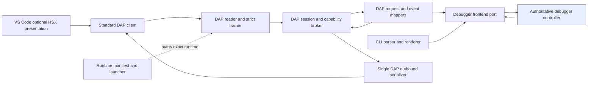
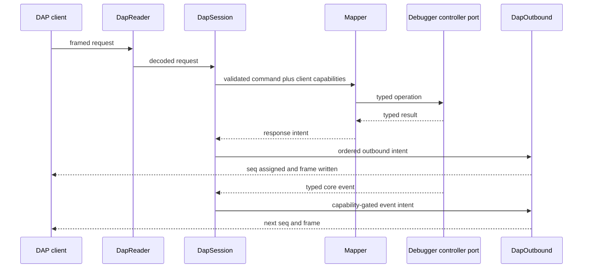

# DBG-ST-004 — Frontend, Packaging, and Production Verification Architecture

- Status: COMPLETE FOR MASTER SYNTHESIS
- Study baseline: `codex/dbg-da-001` activation head
  `ea2b53728de5abfe9e9482560390bd1a2de6c9d2`
- DesignAnalysis: `DBG-DA-001`
- Iteration: `DBG-IT-001-002`
- Owning issue: #38
- Scope owner: bounded Study worker; no product-code authority

## Question and scope

Which thin DAP, CLI, VS Code presentation, runtime-package, compatibility, and production
verification boundaries best satisfy `DBG-R-001..DBG-R-003` and
`DBG-R-026..DBG-R-036` without preserving the current DAP and extension monoliths?

This Study evaluates frontend and delivery boundaries. It consumes, but does not decide,
the controller state machine, executive recovery, stop-epoch, symbol/address, resource,
lifecycle, and stepping policies owned by the other `DBG-DA-001` Studies and the Master
synthesis. No product, extension, test, or package file was changed.

## Evidence inspected

### Authoritative SDP and issue evidence

- `AGENTS.md`, `SDP/README.md`, and `SDP/Shared/Process.md`;
- `SDP/Debugger/README.md` and `SDP/Debugger/Traceability/CurrentIndex.yaml`;
- issue #38 body and all comments through Master activation comment `5345697295`;
- `DBG-ST-001`, accepted `DBG-R-001..DBG-R-036`, `DBG-CR-001`, `DBG-GAP-001`, active
  `DBG-DA-001`, and `DBG-IT-001-002`;
- signed `DBG-RF-001` evidence in
  `Verification/DBG-RF-001--Master_Signoff.md` and
  `Verification/DBG-VER-001-001-001.md`.

The activation head has no product/test delta after signed implementation head
`208063e344b767f82790ce579eba6327e2cdd0ce`. The signed Windows oracle reports `36 passed`
for the targeted DAP CLI/harness/backend suite and proves initialize-response-before-event,
launch/attach through the production wrapper, and strict rejection of unframed DAP output.
Linux remains explicitly unclaimed.

### Product and test evidence

- `vscode-hsx/debugAdapter/hsx-dap.py`;
- `python/hsx_dap/__init__.py`;
- `python/hsx-dap.py`, `python/hsx_dbg.py`, and `python/hsx_dbg/` including CLI context,
  commands, backend/session, REPL, output, and symbols;
- `python/executive_session.py` as the frontend-adjacent executive transport dependency;
- `vscode-hsx/src/extension.ts`, `package.json`, `package-lock.json`, `.vscodeignore`,
  `scripts/bump-version.js`, `README.md`, and `src/test/configProvider.test.ts`;
- tracked `vscode-hsx/hsx-debug.vsix`, including an inspection of its ZIP inventory and
  embedded manifests;
- `python/tests/test_hsx_dap_cli.py`, `test_hsx_dap_harness.py`,
  `test_hsx_dap_reconnect.py`, `test_hsx_dbg_backend.py`, and `dap_stubs.py`;
- DAP fixtures `fixtures/sample_debug.sym` and `fixtures/breakpoints_golden.json`;
- `python/tools/dap_probe.py` as a secondary/manual protocol driver.

### External protocol authority

The current Microsoft [DAP overview](https://microsoft.github.io/debug-adapter-protocol/overview)
and [DAP changelog](https://microsoft.github.io/debug-adapter-protocol/changelog) were checked
as primary protocol sources. The current site identifies DAP 1.71.0. The evidence relevant
to this Study is stable at the capability level: initialize exchanges client/adapter
capabilities; absent capability flags mean unsupported; launch and attach have distinct
ownership semantics; breakpoint configuration is set-based; and stepping granularity,
instruction breakpoints, invalidated events, memory events, read/write memory, and
disassembly each have explicit capability contracts.

## Current-state findings

### ST-004-F1 — The signed DAP baseline is valuable but not yet a modular transport

`DAPProtocol` owns framing and a write lock, but `send_event` and `send_response` allocate
`seq` before `_send_message()` acquires that lock (`python/hsx_dap/__init__.py:51-100`). This
is the still-open `DBG-F-009`: framing writes cannot interleave, but sequence allocation and
wire order can. The adapter reader, executive callback thread, and fallback timers can all
emit output.

`DBG-RF-001` nevertheless created the correct first oracle: the actual wrapper now keeps raw
diagnostics off stdout, orders the initialize response before `initialized`, and is exercised
on Windows. That oracle should be retained and broadened rather than discarded.

### ST-004-F2 — DAP lifecycle and capability negotiation remain embedded and incomplete

`HSXDebugAdapter._handle_request()` dynamically locates `_handle_*` methods and contains the
special initialize-response/event ordering. `_handle_initialize()` returns a fixed literal
capability set and ignores client capability arguments (`python/hsx_dap/__init__.py:282-317`).
There is an implemented function-breakpoint handler but no
`supportsFunctionBreakpoints`; optional `invalidated` output is emitted elsewhere without a
recorded `supportsInvalidatedEvent` gate. Launch and attach still share one handler, and
`configurationDone` is a no-op (`:319-386`). These facts directly confirm `DBG-F-018` and
show that transport, DAP phase, negotiation, and debugger policy are not separate contracts.

The official DAP lifecycle permits launch/attach and configuration to overlap, but requires
the initialize response, `initialized`, breakpoint configuration, and `configurationDone`
sequence to be honored. A dedicated DAP phase model is therefore necessary even though
target lifecycle truth belongs to the shared controller.

### ST-004-F3 — DAP translation still owns core and RPC policy

The 3,256-line `python/hsx_dap/__init__.py` contains connection/reconnect state, breakpoint
desired/remote state, watch ownership, task caches, polling/backoff, fallback timers,
stepping behavior, symbols, DAP handles, and presentation formatting. Disassembly constructs
`disasm.read` and legacy `disasm` RPC dictionaries directly (`:941-1000`). These are the
concrete `DBG-F-014`, `DBG-F-015`, and `DBG-F-017` violations.

The recommended DAP adapter must consume typed frontend/core operations and immutable core
events. It must not call generic `request(dict)` or decide executive fallbacks, resource
ownership, stepping semantics, reconnect, or symbol policy.

### ST-004-F4 — The CLI is not yet a thin peer of DAP

The CLI entrypoint, parsing, history, completion, REPL, and output formatting are useful and
mostly frontend concerns. However, `DebuggerContext` constructs `ExecutiveSession` directly,
owns breakpoint IDs/disabled sets and stack/frame caches, and exposes the session to commands
(`python/hsx_dbg/context.py:10-187`). Command modules issue raw executive request dictionaries
for pause/resume/step, breakpoint/watch, stack, memory, disassembly, attach/detach, and
session operations. Thus CLI and DAP do not consume one behavioral core, confirming
`DBG-F-026`.

### ST-004-F5 — Standard DAP is present, but custom presentation also owns truth and actions

The extension already calls standard DAP requests through VS Code's `customRequest` API for
`readMemory`, `writeMemory`, `evaluate`, `disassemble`, and `setInstructionBreakpoints`.
Those operations can support optional HSX views without inventing a second protocol.

At the same time, the extension has its own run/debug state maps, frame metadata, breakpoint
sets, disassembly breakpoint manager, trace cache, refresh coordination, step-in-flight flag,
and clear-all/stop actions (`vscode-hsx/src/extension.ts:508-920`, `:1128-1672`,
`:1743-1989`, `:2184-2259`). It listens to unnamespaced custom `telemetry` events and uses
unnamespaced custom requests `readRegisters`, `traceControl`, `traceRecords`,
`stepInstruction`, and `clearAllBreakpoints`. This confirms `DBG-F-016`: useful views exist,
but their present implementation is partly a second debugger client/state owner.

### ST-004-F6 — The VSIX is not version-coherent with a debugger runtime

The adapter factory launches `debugAdapter/hsx-dap.py`, then injects the active workspace as
`HSX_REPO_ROOT`, `HSX_WORKSPACE_ROOT`, and leading `PYTHONPATH` entries
(`vscode-hsx/src/extension.ts:79-201`). The wrapper searches its containing repository and
those environment roots for a `python/` directory (`vscode-hsx/debugAdapter/hsx-dap.py:12-38`).

The tracked VSIX contains only the wrapper, compiled extension, manifests, launch file,
README, and version script. It does **not** contain `python/hsx_dap`, `python/hsx_dbg`, or
`python/executive_session.py`. The README explicitly says it relies on the module in the
workspace. This is direct evidence for `DBG-F-021`.

The current source manifest is version `0.0.23`, while the lockfile root package is
`0.0.1`. `prepackage` mutates `package.json` by incrementing the patch version immediately
before packaging. The extension computes a fingerprint of `package.json` and compiled JS,
passes it to the adapter, and the adapter only logs it; there is no runtime manifest/hash
comparison or compatibility refusal. These mechanisms are identifiers, not version
coherence.

### ST-004-F7 — Existing tests are good seeds, but not a release oracle

`test_hsx_dap_cli.py` now launches the same wrapper selected by the extension and validates
strict output framing and initialize/session ordering on Windows. However, the test explicitly
adds the repository and repository `python/` directory to `PYTHONPATH`
(`python/tests/test_hsx_dap_cli.py:94-102`). It therefore proves the wrapper path but not an
installed VSIX in an unrelated workspace.

The DAP harness has useful scenarios for capability output, lifecycle, reconnect,
breakpoints, stack/scopes, disassembly, trace, registers, execution, and golden breakpoints.
Most invoke private `HSXDebugAdapter` methods with broad fake backends, so they preserve
behavior but also couple tests to the monolith.

The npm test compiles TypeScript and runs only `dist/test/configProvider.test.js`.
`configProvider.test.ts` validates defaults and an invalid PID, not adapter launch,
extension-host lifecycle, coordinator, views, commands, or artifact contents. No Linux PASS
is recorded. These facts confirm `DBG-F-022` and `DBG-F-023`.

## Requirements and finding coverage

| Contract/finding | Study result for Master synthesis |
|---|---|
| `DBG-R-001`, `DBG-F-009` | Separate strict framing/parser from a single outbound serializer that assigns sequence numbers and writes frames in one ownership context. |
| `DBG-R-002` | Give DAP protocol phase its own small state machine; it translates but does not own target lifecycle. |
| `DBG-R-003`, `DBG-F-018` | Store client capabilities, derive adapter capabilities from verified core/runtime features, and gate every optional request/event. |
| `DBG-R-026` | DAP, CLI, and extension may consume only the typed debugger-core frontend port, never executive RPC or VM internals. |
| `DBG-R-027`, `DBG-F-014`, `DBG-F-026` | Resource/lifecycle/step/recovery policy moves behind the common port; CLI and DAP become peers. |
| `DBG-R-028`, `DBG-F-015`, `DBG-F-016`, `DBG-F-017` | Use bounded DAP transport, DAP session, mapping, handle, CLI, launcher, and presentation modules with explicit non-responsibilities. |
| `DBG-R-029`, `DBG-R-030`, `DBG-F-016` | Standard VS Code Debug UI is the normal path. Custom HSX views are optional projections, never target truth. |
| `DBG-R-031`, `DBG-F-021` | Vendor the exact pure-Python debugger runtime in the VSIX with a build manifest and runtime preflight; do not import workspace sources. |
| `DBG-R-032`, `DBG-R-033`, `DBG-F-022`, `DBG-F-023` | Test the unpacked/installed artifact, in a clean unrelated workspace, on Windows and Linux; add real extension-host scenarios. |
| `DBG-R-034` | Introduce a versioned compatibility registry with owner, trigger, evidence, and removal condition; no exception-string fallback in frontends. |
| `DBG-R-035` | Record artifact hash, exact source head, exact reviewed head, platform evidence, and reviewer sign-off. |
| `DBG-R-036` | Preserve signed RF-001 and harness behaviors as black-box/golden scenarios before replacing modules; migrate tests to public ports incrementally. |

`DBG-R-004` is also relevant at the DAP edge: DAP integer handles must bind to a controller
stop epoch and must not be silently rebound. The stop-epoch policy itself remains outside
this Study.

## Alternatives

### Frontend/core topology

| Option | Benefits | Costs/risks | Decision |
|---|---|---|---|
| Keep policy-rich DAP and independently repair CLI | Smallest immediate diff | Preserves duplicated policy, raw RPC leakage, races, and divergent behavior | Reject |
| Make DAP the debugger core and turn CLI into a DAP client | One externally visible protocol | Leaks IDE/DAP handles and lifecycle into the core; awkward for CLI and executive capabilities | Reject |
| Shared frontend-neutral controller port; thin DAP and CLI peers | One behavior owner, testable typed boundary, standard DAP translation remains small | Requires controlled migration and a stable port contract | **Recommend** |

### VS Code UX

| Option | Benefits | Costs/risks | Decision |
|---|---|---|---|
| Custom HSX views remain primary | Preserves current visible feature set | Duplicates VS Code debug UI and becomes a second truth owner | Reject |
| Remove all custom views | Simplest extension | Loses useful trace and compact embedded-target displays not covered well by generic UI | Reject |
| Standard DAP first; optional presentation-only HSX views | Normal debugging works in standard clients; preserves differentiated UX | Requires explicit custom-feature negotiation and cache invalidation | **Recommend** |

### Runtime packaging

| Option | Coherence | Cross-platform/release impact | Decision |
|---|---|---|---|
| Continue workspace lookup/PYTHONPATH injection | None; arbitrary workspace code wins | Easy development, unsafe installed product | Reject for production |
| Download/install a wheel into the user's environment at first run | Wheel can be versioned | Network/environment mutation, resolver and permission failures, hard offline oracle | Reject |
| Freeze one native executable per OS/architecture | Strongest interpreter isolation | Large build/signing matrix; slows current pure-Python migration | Defer behind the same launcher contract |
| Vendor immutable pure-Python runtime in VSIX; select a supported external Python interpreter | Extension/runtime bits are one artifact; small universal VSIX; current runtime is stdlib-only | Python availability/version still requires preflight | **Recommend now** |

The packaged runtime should be built once as a normal Python distribution/wheel and then
vendored into the VSIX. The standalone CLI should be installed from that same distribution.
The VSIX must not resolve the runtime from the debuggee workspace. A developer-only source
override may exist, but it must be explicit, visibly unsupported, excluded from release
verification, and entered in the compatibility registry.

### Verification oracle

| Option | What it proves | Decision |
|---|---|---|
| Unit/source-tree tests only | Local functions and source wrapper | Insufficient |
| Wrapper subprocess with repository `PYTHONPATH` | Signed RF-001 framing baseline | Retain as fast regression, not release oracle |
| Unpacked VSIX subprocess + protocol scenarios | Actual shipped runtime/launcher/version manifest | Required production oracle |
| Installed VSIX in a real extension host | Extension activation, launch, standard DAP, commands/views | Required integration layer |
| Live executive sample | Product integration beyond fakes | Required release/nightly layer |

## Recommended architecture



The DAP reader, DAP session, mapper, and writer are separate responsibility blocks. The
controller owns debugger policy; the adapter owns only DAP protocol policy. VS Code custom
views communicate through the VS Code debug session/DAP surface and do not bypass the
adapter into executive RPC.

### Module responsibilities and non-responsibilities

Names below are conceptual; the Master may choose final package paths.

| Proposed module | Responsibilities / owned state | Explicit non-responsibilities | Consumes / exposes |
|---|---|---|---|
| `dap.transport.DapReader` | Strict ASCII header/UTF-8 JSON framing, size limits, EOF/malformed-input result | No request routing, seq allocation, lifecycle, core calls | Emits decoded DAP envelopes |
| `dap.transport.DapOutbound` | Sole outbound queue/writer; allocates `seq` immediately before atomic frame write; supports ordered response+event batches | No target state, handler choice, capability truth | Accepts immutable response/event intents |
| `dap.session.DapSession` | DAP protocol phase, request correlation, initialize client capabilities, launch/attach/configuration ordering, error mapping | No executive connection, reconnect, break/watch/step/symbol policy | Routes envelopes to typed mappers; emits protocol intents |
| `dap.capabilities` | Intersects verified adapter features, controller capabilities, and client capabilities; gates optional events | No feature implementation or optimistic advertisement | Typed capability snapshot |
| `dap.handles` | Maps DAP frame/scope/variable/source integers to immutable `(session, stop_epoch, object_id)` references; never silently rebinds | No stack/variable reconstruction or epoch creation | Consumes controller epoch/snapshot IDs |
| `dap.mappers.*` | Validate DAP arguments and translate typed core results/events for lifecycle, execution, resources, inspection, output | No `request(dict)`, caches, retry, reconciliation, symbols, fallback timers | Consumes `DebuggerFrontendPort`; returns DAP DTOs |
| `cli.application` | Parse commands/scripts, selected presentation context, history/completion, text/JSON rendering, exit codes | No `ExecutiveSession`, raw RPC, resource ownership, target caches, reconnect/step policy | Consumes the same `DebuggerFrontendPort` and core events |
| `extension.configuration` | Separate launch/attach schemas, validation, legacy-config diagnostics | No target lifecycle implementation | Produces DAP configuration |
| `extension.runtimeLauncher` | Locate vendored manifest/runtime, choose supported interpreter, verify version/hash, build sanitized process environment, start adapter | No workspace runtime lookup in production, no debugger policy | Launches canonical packaged DAP entrypoint |
| `extension.sessionPresentation` | Route DAP events to status/views; maintain only disposable derived UI state keyed by debug-session/stop epoch | No authoritative run/debug/connection/resource state | Consumes standard DAP and negotiated `hsx/*` presentation events |
| `extension.views.*` | Render memory/register/disassembly/trace projections and issue standard or negotiated presentation requests | No fallback timers, breakpoint/watch ownership, target polling, direct RPC | Consume VS Code debug-session DAP surface |
| `packaging.runtimeManifest` | Runtime/extension version, source commit, protocol schema versions, Python range, file hashes, compatibility-registry version | No runtime feature decisions | Read by build, launcher, adapter diagnostics, verification |
| `verification.artifactOracle` | Exercise the exact release artifact and record platform/artifact/head evidence | No production behavior | Black-box only |

No row owns transport framing, debugger state policy, resource reconciliation, symbol
interpretation, and IDE presentation together. This satisfies the anti-monolith acceptance
criterion.

## Public frontend/core contract consumed by DAP and CLI

This is a consumer-side proposal, not the controller-policy decision. The common port should
be typed and frontend-neutral. Representative operations are:

```text
connect(ConnectionIntent) -> SessionInfo
attach(AttachIntent) -> TargetSession
launch(LaunchIntent) -> TargetSession
disconnect(DisconnectIntent) -> Completion
terminate(TerminateIntent) -> Completion

execute(ExecutionIntent{continue|pause|instruction|into|over|out}) -> Accepted
replace_breakpoints(OwnerId, BreakpointKind, specs) -> ResourceSetResult
replace_watches(OwnerId, specs) -> ResourceSetResult

threads() -> immutable ThreadSnapshot
stack(stop_epoch, thread_id, range) -> immutable FramePage
scopes(stop_epoch, frame_id) -> immutable ScopeList
variables(stop_epoch, object_id, range) -> immutable VariablePage
evaluate(stop_epoch, frame_id?, expression, context) -> Evaluation
read_memory(stop_epoch, address, length) -> MemoryRead
write_memory(address, bytes) -> MutationResult
disassemble(stop_epoch, address, count, mode) -> InstructionPage

capabilities() -> CoreCapabilities
snapshot() -> ControllerSnapshot
subscribe(callback(CoreEvent)) -> Subscription
```

All mutating calls enter the controller's serialization boundary. Queries either use the
explicit immutable stop epoch or return an explicit `notStopped/staleEpoch/unavailable`
result. Events carry a monotonic controller transition identity and, when stopped-state data
is involved, the stop epoch. There is no public frontend escape hatch equivalent to
`request(payload)`.

DAP translates DAP client identity into an `OwnerId`; CLI does the same for its session.
The resource model and conflict/reconciliation behavior remain controller policy. The CLI
may remember a selected frame **identifier for display**, but the frame object and validity
remain in the controller snapshot. DAP may remember integer handle mappings, but never owns
the referenced data.

## DAP transport, serialization, and lifecycle

### Inbound and outbound ownership

1. `DapReader` is the only stdin reader and validates exact framing, bounded content length,
   UTF-8 JSON object shape, and EOF behavior.
2. Decoded requests enter the `DapSession` inbox. Core event callbacks enqueue typed events;
   they never write stdout.
3. Mappers submit typed controller commands and enqueue completion/event intents back to the
   session.
4. `DapOutbound` is the only stdout writer and the only owner of outbound `seq`.
5. Ordering dependencies are submitted as one batch, for example initialize response then
   `initialized`; unit tests deliberately race event and response producers.
6. Diagnostics use stderr/log files or standard DAP `output` events after negotiation.



`DapSession` needs only DAP phases such as `NEW`, `INITIALIZED`, `CONFIGURING`, `ACTIVE`,
`ENDING`, and `CLOSED`. It must not duplicate controller connection/run/stop state. A launch
or attach operation may be pending while configuration requests arrive; its DAP response is
released at the protocol-defined point without changing the controller's ownership model.

### Capability truth model

- Store initialize arguments including path/line/column conventions and every client
  capability used by HSX (`supportsInvalidatedEvent`, `supportsMemoryEvent`,
  `supportsSteppingGranularity`, and related variable/source capabilities).
- Advertise only capabilities backed by implemented handlers, core capabilities, and passing
  conformance tests. For example, function breakpoints cannot remain implemented-but-hidden,
  and terminate cannot be advertised until its real semantics satisfy `DBG-R-006`.
- Omit unsupported flags rather than filling a broad static dictionary with hopeful values.
- Gate `invalidated` and memory events on their client capabilities. Fall back to normal
  stopped/request refresh behavior, not an unsolicited optional event.
- Use standard `next`/`stepIn`/`stepOut` with `granularity: "instruction"` for instruction
  stepping when negotiated, rather than the current unnamespaced `stepInstruction` request.
- Custom HSX presentation starts with an explicit versioned custom handshake, for example
  `hsx/presentation/initialize`. Only then may `hsx/*` requests/events be used. A generic DAP
  client receives only standard DAP.

## Standard DAP versus optional HSX presentation

| Capability | Normal/required surface | Optional HSX view role | Current behavior decision |
|---|---|---|---|
| Threads, call stack, scopes, variables, watches, registers | Standard `threads`, `stackTrace`, `scopes`, `variables`, `evaluate`; registers use a standard scope presentation hint | Compact register/stack rendering and copy | Adapt views to standard data; retire `readRegisters` once parity is captured |
| Source/function/instruction breakpoints | Standard set-based breakpoint requests and events | Disassembly-row affordance may request an explicitly owned instruction breakpoint through negotiated presentation API if VS Code exposes no safe standard UI hook | Replace synthetic breakpoint truth/clear-all behavior; controller owns provenance |
| Continue/pause/source step/instruction step | Standard execution requests and stepping granularity | Toolbar aliases invoke standard debug commands | Retire `stepInstruction` custom request after compatibility window |
| Memory | Standard `readMemory`/`writeMemory`, memory references, optional memory events | Windowed hex/ASCII view and explicit edit UX | Reuse/adapt presentation; no independent cache truth |
| Disassembly | Standard `disassemble`, instruction references, source mapping | Window, follow-PC, copy, highlight | Reuse/adapt presentation |
| Status and errors | Standard stopped/continued/terminated/output plus DAP request failures | Status-bar projection of core health | Replace unnamespaced `telemetry` with negotiated `hsx/*` event or structured standard output data where suitable |
| Trace capture/history | No sufficient generic DAP request for HSX trace control/history | Retain as explicitly versioned, negotiated `hsx/trace/*` presentation extension | Adapt, namespace, version, and test |
| Stop/terminate/disconnect | Standard VS Code debug actions and DAP lifecycle | No alternate semantic | Remove custom “stop target” bypass; surface only the accepted lifecycle contract |

Custom-view caches must be disposable derived state keyed by VS Code debug session and stop
epoch/transition ID. A new stop epoch, continued/terminated event, failed custom handshake,
or session switch invalidates them. Views must show unavailable/stale explicitly rather than
polling or synthesizing truth.

## Version-coherent runtime package

### Artifact model

The recommended release unit is one VSIX containing:

```text
extension/
  dist/extension.js
  debugAdapter/hsx-dap.py          # minimal immutable launcher
  runtime/                         # vendored contents of exact Python distribution
    hsx_debugger_core/...
    hsx_debugger_dap/...
    hsx_debugger_cli/...
    runtime-manifest.json
```

The conceptual package split prevents importing CLI/frontend code when DAP imports the core.
It may be delivered as one Python distribution initially, but import direction must be
`DAP -> public core port` and `CLI -> public core port`, never `core -> CLI`.

`runtime-manifest.json` should contain at least:

- extension version and debugger runtime version;
- source commit and dirty-state prohibition;
- DAP schema/conformance baseline and HSX presentation protocol version;
- debugger-core public API version and executive-protocol compatibility range;
- minimum/maximum supported Python version and supported platforms;
- compatibility-registry version;
- SHA-256 hashes for the launcher and vendored runtime files.

The current syntax requires at least Python 3.10 in several CLI modules; the accepted package
must declare and test its real range rather than discover incompatibility at import time.

### Launcher behavior

1. Resolve the manifest/runtime relative to the installed extension, never the workspace.
2. Select interpreter using explicit configuration, extension setting, then documented
   platform candidates.
3. Run a bounded preflight that validates Python range, importability from the vendored
   runtime, manifest/runtime version/hash, and supported architecture.
4. Start the canonical module entrypoint with a sanitized environment. The debuggee workspace
   remains `cwd` only when appropriate; it is not added to adapter import paths.
5. Report bootstrap failure via stderr/log and an actionable VS Code error. Never write raw
   stdout.

The existing `--adapter-version`/fingerprint is useful diagnostic input but must not be the
coherence mechanism. Runtime and extension must compare independently derived manifest
values. Developer source override must require an explicit setting and conspicuous warning.

### Deterministic build and release

- Version is an explicit release input applied to `package.json`, lockfile root, Python
  distribution metadata, and runtime manifest together. Remove mutation-on-`prepackage`;
  the same exact head and inputs must reproduce the same logical artifact.
- Build the Python distribution once, vendor it, compile TypeScript, produce VSIX, extract
  VSIX, validate inventory/hashes/versions, then run all artifact tests against that exact
  extracted tree.
- Treat the VSIX as a CI/release artifact identified by SHA-256. A tracked hand-built VSIX is
  not release evidence unless regenerated and matched to the exact signed head.
- The standalone CLI release uses the same Python distribution/version and compatibility
  registry as the vendored adapter.

## Compatibility registry

Compatibility must be data-backed and owned, not inferred from exception strings. Each
entry should record:

```text
id, layer, behavior, capability_or_version_trigger, introduced_in,
last_supported_in, owner_refactor, required_tests, observability_key,
removal_condition, default_enabled
```

Rules:

1. DAP client compatibility is owned in `dap.capabilities` and protocol mappers.
2. Executive/RPC compatibility is owned below the public core port, never in DAP/CLI/views.
3. Packaging/source override compatibility is owned by the launcher.
4. Custom VS Code presentation compatibility is namespaced and version-negotiated.
5. Every fallback is capability/version triggered, bounded, logged once with its registry ID,
   and covered by positive and removal tests.
6. A fallback with no owner/removal condition is not admitted.

### Initial registry candidates

| Current behavior | Interim decision | Removal/retention rule |
|---|---|---|
| `disasm.read` -> legacy `disasm` fallback in DAP | Move below core port; capability/version select, not error-string select | Remove when minimum executive protocol guarantees `disasm.read` and legacy fixture has zero supported consumers |
| `python/hsx-dap.py` source entrypoint | Retain as developer shim to canonical packaged entrypoint for a declared window | Remove after documented CLI/tool callers and probes use canonical entrypoint for one release cycle |
| Workspace `HSX_REPO_ROOT`/`PYTHONPATH` bootstrap | Production removal; optional explicit developer override only | Remove override when editable/install workflow replaces source-tree launch |
| Launch-with-existing-PID presented as attach | Visible deprecated config migration only; no silent semantic preservation | Remove after separate launch/attach schema and lifecycle parity are released and tested |
| Unnamespaced `stepInstruction`, `readRegisters`, `clearAllBreakpoints` | Translate during one versioned extension/runtime window if needed | Replace by standard DAP; remove after packaged previous extension version is outside supported range |
| Unnamespaced `traceControl`, `traceRecords`, `telemetry` | Adapt to versioned `hsx/trace/*` and `hsx/*` events | Retain only because DAP lacks equivalent trace UX; remove legacy names after compatibility window |
| `threadsRequest` alias | Registry entry only if a supported historical client actually uses it | Otherwise delete after black-box search/test evidence; do not retain speculative aliases |

## Production-path verification architecture

### Layered matrix

| Layer | Windows and Linux evidence | Failure oracle |
|---|---|---|
| 0 — static/build | Python compile/import graph, TypeScript strict compile, manifest/lock/runtime version equality, deterministic inventory, compatibility schema | Any mismatch or undeclared dependency fails |
| 1 — unit/contracts | Strict DAP reader; one outbound seq owner under raced producers; DAP phase transitions; capability intersections/gates; mappers against typed port fakes; CLI parser/renderers; extension modules | No private monolith tests accepted as sole evidence |
| 2 — packaged adapter black box | Extract built VSIX into temp directory; scrub repository `PYTHONPATH` and HSX root variables; use unrelated temp workspace; run canonical wrapper | Any unframed byte, repo import, version mismatch acceptance, hang, or wrong lifecycle order fails |
| 3 — DAP scenario/conformance | initialize/configure/launch and attach; capabilities; breakpoints; pause/continue; instruction and source step; stack/scopes/variables/evaluate; memory/disassembly; reconnect/stream loss | Standard messages and golden semantic results checked at byte boundary |
| 4 — VS Code extension host | Install exact VSIX in automated VS Code on both OSes; resolve config; launch adapter; exercise standard Debug surfaces plus negotiated views/commands | Extension activation/launcher/view/session error fails |
| 5 — live executive | Real executive + deterministic HSX sample for attach/launch, stop/inspect/resources/recovery | Compare against accepted scenario evidence and no direct frontend RPC |
| 6 — release sign-off | Repeat mandatory artifact subset on the immutable VSIX hash; independent exact-head review; requirement/finding matrix | No release/sign-off if artifact, head, review, or either required OS differs |

The RF-001 subprocess test remains Layer 2's first framing scenario, but is changed to import
only from the extracted artifact. A separate source-tree test may remain for developer speed.

### Required negative controls

- inject raw stdout prefix, suffix, malformed/oversized headers, truncated UTF-8/JSON, and
  concurrent response/event producers;
- start from a workspace containing a malicious or incompatible `python/hsx_dap` and prove
  the vendored runtime wins;
- scrub Python/runtime environment variables and verify documented interpreter discovery;
- force unsupported Python, manifest hash mismatch, extension/runtime mismatch, executive
  protocol mismatch, and custom presentation version mismatch; require actionable fail-closed
  behavior;
- send initialize clients with optional capabilities both true and absent and assert events
  are gated;
- run a generic DAP client without HSX presentation handshake and prove standard debugging
  remains sufficient;
- install old/new supported extension-runtime combinations only where the registry explicitly
  allows them; reject all others;
- repeat startup/shutdown/reconnect loops to expose cleanup races and leaked processes.

### Test migration rule

Before moving a behavior out of `HSXDebugAdapter` or `extension.ts`, capture it at the public
DAP/artifact boundary. Then add contract tests against the new public core port and only then
remove the private-handler test. Golden files must record semantic DAP messages with volatile
`seq`, timestamps, paths, and process IDs normalized explicitly; they must not normalize away
ordering, capability, stop reason, ownership, or epoch identity.

## Frontend/package reuse, adapt, replace matrix

This matrix is scoped to `DBG-ST-004`; the Master merges it with the full audit from
`DBG-ST-005`.

| Current component/behavior | Decision | Rationale and requirement | Migration verification |
|---|---|---|---|
| `vscode-hsx/debugAdapter/hsx-dap.py` | **Adapt/replace bootstrap** | Keep minimal script location/stdio contract from RF-001; replace repo-root search with relative vendored-runtime manifest (`DBG-R-001`, `DBG-R-031`, `DBG-R-032`) | Extracted VSIX starts with scrubbed env/unrelated workspace on both OSes |
| `python/hsx-dap.py` | **Retain temporarily as shim** | Useful developer entrypoint, but must delegate to canonical package and cannot be production oracle (`DBG-R-032`, `DBG-R-034`) | Shim and packaged entrypoint share scenario suite; registry removal test |
| `DAPProtocol` | **Adapt/extract** | Preserve correct Content-Length encoding and RF-001 purity; split reader/writer and move seq inside sole writer (`DBG-R-001`, `DBG-R-008`) | Race, malformed-input, strict byte-boundary tests |
| `HSXDebugAdapter` monolith | **Replace structure; preserve selected mappings as behavior** | It violates `DBG-R-027` and `DBG-R-028`; do not wholesale rewrite behavior without oracle (`DBG-R-036`) | Black-box parity scenarios before each mapper migration |
| Existing DAP handlers/formatters | **Adapt selectively into typed mappers** | Useful DAP DTO behavior; remove raw RPC, policy, state caches, fallbacks (`DBG-R-026`, `DBG-R-027`, `DBG-R-028`) | Mapper contract tests plus product DAP goldens |
| Frame/scope/source maps | **Replace with DAP handle registry bound to controller epochs** | DAP-specific handles are valid frontend responsibility, but referenced truth is not (`DBG-R-004`, `DBG-R-027`) | repeated/out-of-order stack/scopes/variables and epoch invalidation tests |
| `python/hsx_dbg` CLI parser/history/completion/REPL/output | **Reuse/adapt** | Natural frontend-only assets | Existing command/script/history tests plus public-port fake tests |
| `DebuggerContext` and command raw requests | **Replace boundary** | Direct `ExecutiveSession`, breakpoint policy, stack cache violate shared-core requirement (`DBG-R-026`, `DBG-R-027`, `DBG-F-026`) | CLI/DAP scenario parity over one controller fixture; static no-raw-RPC import check |
| `vscode-hsx/src/extension.ts` | **Replace monolithic structure by extraction** | Preserve behavior, not file layout (`DBG-R-028`, `DBG-R-029`, `DBG-R-030`, `DBG-F-016`) | Module unit tests and extension-host scenarios before deleting old path |
| `HSXConfigurationProvider` | **Adapt** | Defaults/validation useful; must define true attach/launch schemas and migration diagnostics (`DBG-R-002`, `DBG-R-029`) | config unit + extension-host launch/attach tests |
| `HSXAdapterFactory` | **Replace launcher internals** | VS Code factory concept is correct; workspace runtime injection is not (`DBG-R-031`, `DBG-R-032`) | artifact manifest/preflight/clean-workspace tests |
| Status tracker | **Adapt as derived presentation** | Useful UX if driven solely by standard/core-derived DAP events (`DBG-R-029`) | session switching, loss, reconnect, terminate tests; no independent transition source |
| View coordinator state maps | **Replace/minimize** | Current run/debug/frame maps can become competing truth (`DBG-R-029`) | stale-epoch/session-switch tests; views display unavailable rather than poll |
| Memory/register/stack/disassembly presentation | **Reuse behavior, adapt data source** | Valuable UX proven by legacy implementation; standard DAP must work first (`DBG-R-030`, `DBG-R-036`) | standard UI scenario first, then optional view parity |
| Trace presentation | **Reuse/adapt and namespace** | HSX-specific value without a complete standard DAP equivalent (`DBG-R-029`, `DBG-R-034`, `DBG-R-036`) | custom handshake/version tests and generic-client absence test |
| Disassembly breakpoint manager/synthetic documents | **Replace policy; possibly reuse rendering metadata** | It mirrors/changes breakpoint truth and clear-all behavior (`DBG-R-014`, `DBG-R-029`) | multi-owner DAP/CLI tests; no external-resource deletion |
| Custom `stepInstruction`, `readRegisters`, `clearAllBreakpoints` | **Retire after bounded compatibility** | Standard DAP covers the normal capability (`DBG-R-003`, `DBG-R-030`, `DBG-R-034`) | old/new extension matrix during window; standard request parity |
| Custom trace/status messages | **Adapt to negotiated `hsx/*` protocol** | Retain only HSX-specific surface; current names are unversioned | schema/version negotiation and rejection tests |
| `package.json` contributions | **Adapt** | Views/commands/debug type useful; launch/attach schema and activation must match truth | manifest schema snapshot + extension-host tests |
| npm scripts and `bump-version.js` | **Replace release flow** | Prepackage mutation and lockfile version drift defeat deterministic coherence (`DBG-R-031`, `DBG-R-035`) | clean-head reproducibility, version equality, artifact hash record |
| tracked `hsx-debug.vsix` | **Retire as hand-built source artifact or regenerate only by controlled release** | Current inventory lacks runtime and is not exact-head evidence | release CI publishes immutable hash and validates embedded manifest |
| `test_hsx_dap_cli.py` RF-001 scenarios | **Reuse and extend** | Signed production-wrapper oracle (`DBG-R-032`, `DBG-R-036`) | Run against extracted VSIX on Windows/Linux; retain raw-byte controls |
| DAP harness/reconnect/backend tests and fixtures | **Adapt** | Broad behavior evidence; too coupled to private monolith | Move behavior to public DAP/core contract tests before deleting private tests |
| `dap_stubs.py` | **Adapt to typed controller port fake** | Keeps subprocess deterministic without preserving backend shape | Same black-box scenarios with typed fake and no product test hook in release |
| `configProvider.test.ts` | **Reuse/expand** | Good seed, far too narrow (`DBG-F-023`) | Module tests plus automated extension-host/product artifact suite |
| `python/tools/dap_probe.py` | **Adapt as diagnostic, not oracle** | Currently launches source entrypoint; useful manual client | Default to canonical artifact/entrypoint and share strict parser library only in tests |

## Migration sequence and Refactor interfaces

This sequence is a proposal for dependency planning, not implementation authorization.

1. **Freeze public contracts and goldens.** Master accepts controller frontend port, core
   event DTOs, stop-epoch reference contract, compatibility registry schema, and package
   manifest. Extend RF-001 black-box evidence before moving behavior.
2. **Controller/transport/symbol/resource/lifecycle Refactors (`DBG-RF-002..006`).** They expose
   typed operations/events used here. Frontend workers must not bypass incomplete operations
   with raw RPC.
3. **Thin DAP (`DBG-RF-007`).** Establish reader/session/capability/handle/mapper/writer
   modules. Migrate one vertical standard DAP scenario at a time behind the same production
   entrypoint. Keep the legacy adapter available as oracle until parity gates pass.
4. **Modular extension and package (`DBG-RF-008`).** Split configuration, immutable launcher,
   session presentation, and views. Build/vend the exact runtime. Make standard DAP scenarios
   pass before optional views. Add a versioned custom presentation handshake.
5. **Cross-platform release oracle (`DBG-RF-009`).** Test the immutable VSIX and same Python
   distribution/CLI on Windows and Linux, then perform exact-head architecture/product review
   and release sign-off.

Interface freeze points:

- `DBG-RF-007` may begin only after the controller command/event/epoch/capability ports it
  consumes are accepted and sufficiently implemented;
- `DBG-RF-008` depends on the canonical packaged DAP entrypoint, DAP capabilities, and custom
  presentation schema from `DBG-RF-007`;
- `DBG-RF-009` owns platform/release proof, but every earlier Refactor must add its own fast
  Windows/Linux-capable tests rather than deferring all portability failures;
- the package launcher is the only shared file boundary between DAP packaging and extension;
  its manifest and process contract must be frozen before parallel workers are allowed.

## Risks and mitigations

| Risk | Mitigation / required evidence |
|---|---|
| Big-bang adapter rewrite loses mature edge behavior | Vertical migration behind public DAP black-box goldens; keep legacy entrypoint available until parity |
| Controller port becomes an untyped generic escape hatch | No public `request(dict)`; typed DTOs and static/import review |
| “Thin” DAP session grows into a second state machine | Limit its state to DAP protocol phase, client capabilities, request correlation, and handle mapping |
| External Python is missing or incompatible | Declared Python range, launcher preflight, actionable VS Code diagnostics, both-OS artifact tests |
| Vendored runtime accidentally imports workspace code | Sanitized `sys.path`/environment, malicious-workspace negative control, manifest hash validation |
| Custom views silently diverge from standard UI | Standard-DAP-first acceptance gate; custom view parity is additive and epoch-keyed |
| Custom protocol becomes unbounded | One namespaced, versioned presentation schema and explicit handshake/registry owner |
| Compatibility paths become permanent | Last-supported version and executable removal test on every registry entry |
| Reproducibility differs across OS | One version input, locked Node/Python build dependencies, normalized archive metadata where possible, per-OS artifact inventory/hash records |
| Extension tests remain mocks only | Add VS Code extension-host tests against exact VSIX and live executive release smoke |

## Open questions for Master synthesis / Steering Group

1. **Python support range:** Is Python 3.10+ an acceptable explicit prerequisite, or must
   packaging include self-contained native runtimes? This Study recommends 3.10+ external
   Python initially and preserves a launcher interface for later frozen executables.
2. **Distribution topology:** Should the same versioned Python distribution publish both CLI
   and DAP entrypoints, with the exact wheel vendored into VSIX? This is recommended; separate
   packages add skew risk without current dependency benefit.
3. **True launch capability:** Until the controller/executive has an accepted launch contract,
   should the extension expose attach only? This Study recommends yes; do not label existing-PID
   attach as launch.
4. **Instruction-breakpoint UX:** If VS Code's public extension API cannot safely create
   standard instruction breakpoints from a custom tree, should the disassembly toggle be
   temporarily removed or use a negotiated presentation command with explicit owner
   provenance? Core ownership must be resolved before retaining it.
5. **Trace custom schema:** Confirm which trace operations remain outside standard DAP and
   allocate one versioned `hsx/trace/*` contract rather than multiple ad hoc commands.
6. **Artifact retention:** Confirm that generated VSIX files move to release artifacts rather
   than remaining hand-built tracked binaries.
7. **Supported version window:** Steering must choose how many previous extension/runtime and
   executive-protocol versions are supported; the registry cannot invent this product policy.

None of these questions justifies product implementation before Steering accepts the Master
DesignAnalysis and proposed design contracts.

## Proposed architecture/design concepts for Master allocation

These are proposal concepts only. The Master owns stable `DBG-A-*` / `DBG-D-*` numbering and
cross-domain synthesis.

| Candidate concept | Proposed decision |
|---|---|
| Architecture — frontend-neutral debugger port | DAP and CLI are peer adapters over one typed controller command/query/event surface; executive RPC is inaccessible to frontends. |
| Architecture — standard DAP first | Normal debugging requires no HSX custom views; optional views are presentation-only and version-negotiated. |
| Architecture — immutable version-coherent artifact | VSIX vendors the exact pure-Python runtime and manifest; standalone CLI comes from the same distribution. |
| Architecture — artifact-as-release-oracle | The unpacked/installed VSIX hash, not a source wrapper, is the production verification subject on Windows and Linux. |
| Design — DAP transport/session split | One strict reader, one DAP phase/capability session, typed mappers/handles, and one seq-owning outbound serializer. |
| Design — capability derivation and gating | Adapter capabilities derive from verified implementation/core capability; optional output is gated on client capability; custom presentation has explicit handshake. |
| Design — CLI boundary | CLI retains parse/render/history UX but consumes only the public core port and immutable events/snapshots. |
| Design — extension decomposition | Configuration, runtime launcher, session presentation, and individual views are separate modules with no target truth. |
| Design — package manifest/launcher | Relative vendored runtime, declared Python range, hashes/API/protocol versions, sanitized environment, fail-closed preflight. |
| Design — compatibility registry | Every shim/fallback is named, version/capability-scoped, observable, tested, owned, and has a removal condition. |
| Design — cross-platform verification ladder | Unit -> extracted VSIX -> DAP scenarios -> extension host -> live executive -> exact-artifact sign-off on Windows/Linux. |

## Conclusion

The optimal frontend architecture is not a cleaned-up version of the current DAP or
extension monolith. It is a shared typed debugger controller port with two thin peer
frontends, a DAP edge split into bounded protocol modules with exactly one outbound owner,
and a VS Code extension that treats standard DAP as the product and custom HSX views as
optional projections.

The optimal current delivery model is an immutable VSIX that vendors the exact pure-Python
debugger distribution and verifies it with a manifest before launch. The signed RF-001
wrapper/framing work is retained as the first black-box oracle, then moved to the extracted
artifact path and executed on Windows and Linux. Compatibility becomes a versioned registry,
not exception matching or workspace bootstrap. The legacy implementation remains available
until public DAP/CLI/artifact parity is captured and independently reviewed.

This Study is complete for Master synthesis. It does not accept any `DBG-A-*` or `DBG-D-*`
contract and grants no implementation authority to `DBG-RF-002..DBG-RF-009`.
