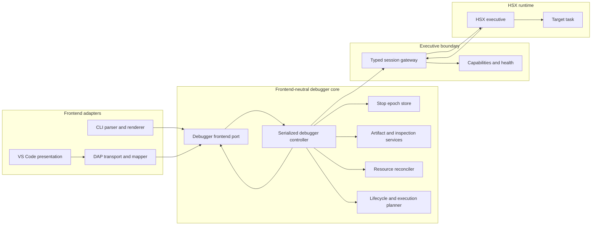
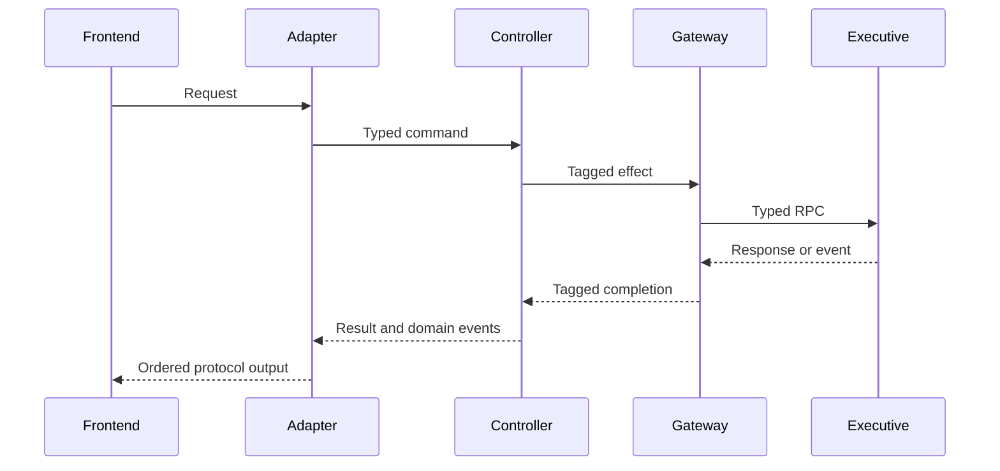
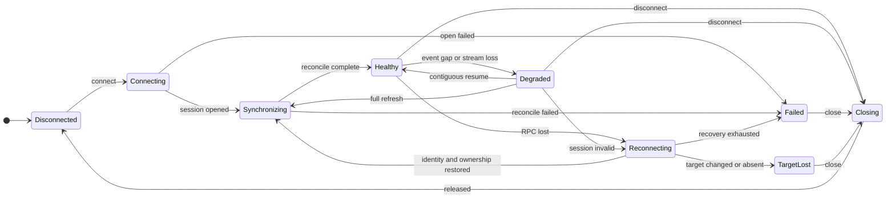
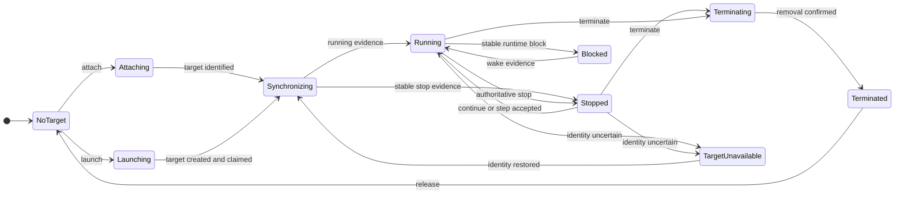

# Proposed Modular Debugger Architecture

- Status: PROPOSED / PENDING STEERING ACCEPTANCE
- DesignAnalysis: `DBG-DA-001`
- Evidence: `DBG-ST-001..DBG-ST-005`, `DBG-CR-001`, `DBG-GAP-001`
- Requirements: `DBG-R-001..DBG-R-036`
- Target state: not implemented

This document proposes architecture boundaries. It is not an accepted `DBG-A-*` baseline and
does not authorize product implementation.

## Proposed architecture decisions

| ID | Proposed decision | Primary requirements |
|---|---|---|
| `DBG-A-001` | One actor/command-queue `DebuggerController` is the sole writer of lifecycle, target, operation, recovery, and stop-epoch state. | R-004, R-007, R-008, R-020, R-027, R-028 |
| `DBG-A-002` | A typed Executive Gateway owns RPC/event transport, capabilities, cursors, and explicit RPC/event health; it never owns debugger policy. | R-009..R-013, R-026, R-027, R-034 |
| `DBG-A-003` | Stable target/image identities and immutable stop epochs bind every inspection handle and result; stale references fail explicitly. | R-004, R-021, R-022, R-025 |
| `DBG-A-004` | Debug artifacts, source resolution, address interpretation, and snapshot inspection are bounded services, separate from transport and frontends. | R-021..R-025, R-028, R-036 |
| `DBG-A-005` | One frontend-neutral Resource Catalog/Reconciler owns desired-vs-actual breakpoints and live watches with owner/provenance. | R-014, R-015, R-027, R-028, R-036 |
| `DBG-A-006` | Explicit lifecycle policy and one bounded Execution Planner own attach/launch/disconnect/terminate and instruction/into/over/out semantics. | R-005, R-006, R-016..R-020, R-027, R-030, R-036 |
| `DBG-A-007` | CLI and DAP are thin peer frontends; VS Code is standard-DAP-first presentation, and the VSIX launches an immutable version-coherent Python distribution. | R-001..R-003, R-026..R-032, R-034 |
| `DBG-A-008` | Migration is strangler-style through classified regression oracles, a named compatibility registry, immutable release artifacts, Windows/Linux evidence, and exact-head gates. | R-031..R-036 |

All IDs above remain proposed until issue #38 records Steering acceptance.

## Context and dependency diagram

The diagram shows dependency direction, not shared mutable ownership. Cyclic request/event
flow is carried by typed immutable messages through the controller inbox.

## Responsibility boundaries

| Boundary | Responsibilities | Explicit non-responsibilities | Mutable-state/concurrency owner |
|---|---|---|---|
| `DebuggerController` | Validate commands, serialize transitions, own lifecycle/health/target/operation state, publish ordered domain events, coordinate effects | Socket I/O, DAP objects, symbol parsing, resource algorithms, UI caches, VM logic | Sole controller actor |
| Controller model/reducer | Pure state transition rules, invariants, effects, results | I/O, sleeps, callbacks, locks | Immutable state values |
| Stop Epoch Store | Epoch identity, immutable snapshots, handle allocation/validation/invalidation | Fetching data, source interpretation, DAP integer mapping | Mutated only through controller lane |
| Executive Gateway | JSON/RPC/event sockets, session negotiation, PID-lock request, keepalive, event cursor/ACK, typed completions/health notices | Debugger truth, implicit policy reconnect, resource adoption, frontend events | Gateway workers own transport only |
| Artifact Index | Validate image-bound debug metadata; immutable symbol/instruction/location/type indexes | Local filesystem choice, live target reads, run control | Immutable cache by image ID |
| Source Resolver | Case-preserving artifact identity to local-path mapping with ambiguity diagnostics | Symbol parsing, target state, UI navigation policy | Mapping updates serialized through controller |
| Inspection Service | Epoch-bound registers/stack/variables/memory/disassembly with partial diagnostics | Run control, transport retry, DAP handles | Immutable per epoch |
| Resource Reconciler | Owner-scoped desired/observed breakpoints and live watches, logical/remote identity, conditional reconciliation | Symbol parsing beyond typed resolver, transport, presentation | Controller-serialized resource state |
| Lifecycle Policy | Attach/launch/detach/disconnect/terminate intent and target-ownership effects | Wire RPC, DAP names, step algorithm | Controller-owned policy record |
| Execution Planner | Instruction/into/over/out plan, budgets, internal condition ownership, preemption, completion classification | Frontend messages, wire fallback selection, debug artifact parsing | One controller-owned plan per target |
| DAP frontend | Strict reader, DAP phase/capability state, typed mapping, epoch-bound DAP handles, one seq-owning writer | Reconnect, target truth, resource policy, source-step policy, raw executive RPC | DAP session and writer only |
| CLI frontend | Commands/scripts/history/completion and text/JSON rendering | Direct `ExecutiveSession`, target caches, independent policy | User presentation state only |
| VS Code extension | Configuration, immutable runtime launch, derived status, optional presentation-only views | Runtime truth, resource reconciliation, direct executive access | Disposable per-session UI projections |
| Package/verification | Runtime manifest, hashes, supported Python range, artifact inventory and black-box release oracle | Product policy and debugger state | Immutable build evidence |

No proposed component owns transport framing, debugger state policy, resource reconciliation,
symbol interpretation, and IDE presentation together.

## Core command and event flow

Blocking I/O never runs on the controller actor. Gateway completions, events, health notices,
and deadlines are immutable inbox messages tagged with session, target generation, and
operation identity. Late/stale messages cannot mutate current state.

## State ownership model

Connection/session health and target execution are orthogonal.

`Healthy` requires an acceptable RPC path and the negotiated event/fallback authority. A live
TCP socket alone is not debugger health.

A stop epoch is created only for inspection-stable stopped evidence. It is invalidated before
resume, target-generation change, or uncertain recovery. Deadlines may fail or reconcile an
operation but never fabricate running/stopped state.

## Architectural invariants

1. Only the controller actor mutates authoritative debugger state.
2. Every effect/completion/event/deadline is tagged with session, target generation, and
   operation identity; stale input is rejected deterministically.
3. Frontends cannot call raw executive RPC or mutate VM internals.
4. Healthy event-capable sessions perform no periodic task/resource polling.
5. Fallback modes are capability-selected, bounded, observable, tested, and removable.
6. ACK never advances beyond an event successfully applied by the controller.
7. Reconnect becomes healthy only after identity, ownership, capabilities, cursor/state,
   resources, and stop epoch are reconciled.
8. Inspection handles never silently rebind across epochs.
9. Standard debugger watch expressions are snapshot queries; persistent live watches are a
   separate optional HSX resource.
10. Frontend output has one ordered writer per protocol connection.
11. Optional VS Code views are derived projections and never target truth.
12. Compatibility has a named owner, version/capability trigger, evidence, and removal test.

## Cross-track boundary

The architecture consumes portable HSX contracts for target/image/stream identity, address
spaces, causal stop evidence, snapshot consistency, ABI/unwind, exact step primitives,
lifecycle authority, and resource provenance. `DBG-ST-006` records these questions and points
to `HSX-ST-001`. Debugger modules may expose typed dependency ports and a conservative legacy
mode, but may not invent portable answers.

## Proposed downstream ownership

- `DBG-RF-002`: controller actor/model, authoritative state, operation correlation, stop
  epochs, frontend port.
- `DBG-RF-003`: typed Executive Gateway, session/event health, capabilities, cursor/ACK,
  recovery primitives.
- `DBG-RF-004`: target/image/address DTO integration, artifact/source/inspection services.
- `DBG-RF-005`: Resource Catalog/Reconciler, owner/provenance, breakpoint/live-watch policy.
- `DBG-RF-006`: lifecycle policy, execution planner, canonical run/stop reasons.
- `DBG-RF-007`: thin CLI/DAP frontend migration, modular DAP transport/session/mappers/handles.
- `DBG-RF-008`: modular VS Code presentation and version-coherent runtime package.
- `DBG-RF-009`: immutable artifact, Windows/Linux, live-executive, and final exact-head oracle.

These ownership statements remain proposed until Steering accepts `DBG-DA-001` and the
relevant detailed contracts.
