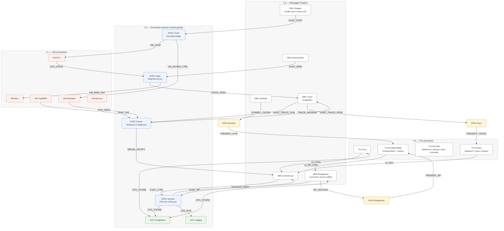

# (3) Requirements — HSX Debugger (Layered model with named links)

> Målet er å gjøre kravene enklere å tenke på ved å **knytte dem til et diagram**. Vi navngir lag, moduler og koblinger, og bruker disse navnene som overskrifter for kravene.

---

## 1) Arkitekturdiagram (lag, moduler og navngitte koblinger)

**Navnekonvensjoner**  
- **Lag:** `L1..L4`.  
- **Moduler:** `TUI_*`, `DBG_*`, `EXEC_*`, `VM_*`, `SVC_*`, `DATA_*`.  
- **Koblinger:** korte kodenavn (`UI_CTRL`, `EXEC_CTRL`, `TRAP_SIG`, …) som brukes i krav/overskrifter.

---

## 2) Liste over overskrifter (kopiér til innholdsfortegnelse)

### Lag
- [L4] TUI (ncurses)
- [L3] Debugger Engine
- [L2] Executive (execd control plane)
- [L1] VM & Runtime

### Moduler
- [TUI_CORE] TUI.Core
- [TUI_PANELS] TUI.Panels — Registers | Trace | Disasm
- [TUI_AUX] TUI.AuxTabs — Mailboxes | dmesg | stdio | scheduler
- [TUI_BP] TUI.BreakpointMgr — Funksjonsliste + disasm
- [DBG_LOOP] DBG.ControlLoop
- [DBG_STEP] DBG.Stepper — single-step & step-over
- [DBG_BP] DBG.Breakpoints — virtual PC-check & BRK
- [DBG_DIS] DBG.Disassembler
- [DBG_SYM] DBG.Symbols
- [DBG_TRACE] DBG.Trace — ringbuffer
- [EXEC_SESSION] EXEC.Session — PID lock & lifecycle
- [EXEC_CLOCK] EXEC.Clock — run/step bridge
- [EXEC_STATE] EXEC.State — reg/mem proxy
- [EXEC_EVENTS] EXEC.Events — telemetry & mailboxes
- [SVC_CFG] SVC.Config/Save
- [SVC_LOG] SVC.Logging
- [VM_CPU] VM.CPU
- [VM_MEM] VM.Mem
- [VM_TRAP] VM.Trap/BRK
- [VM_SCH] VM.Scheduler
- [VM_DEV] VM.Devices
- [DATA_SYM] DATA.Symbols
- [DATA_TRACE] DATA.Trace
- [DATA_BP] DATA.Breakpoints

### Koblinger (interfaces)
- [UI_CTRL] UI Control (TUI.Core → DBG.ControlLoop)
- [UI_NAV] UI Navigation (TUI.Panels → DBG.ControlLoop)
- [UI_BP_CTRL] UI Breakpoints Control (TUI.BreakpointMgr → DBG.Breakpoints)
- [EXEC_CTRL] Executive Control (DBG.ControlLoop → EXEC.Session)
- [EXEC_STEP] Executive Step Bridge (DBG.Stepper → EXEC.Clock)
- [EXEC_BP] Breakpoint Sync (DBG.Breakpoints → EXEC.Session)
- [EXEC_MEM] Memory Proxy (DBG.Disassembler → EXEC.State)
- [EXEC_TRACE_SUB] Trace Subscription (DBG.Trace → EXEC.Events)
- [SESSION_FEED] Session Updates (EXEC.Session → DBG.ControlLoop)
- [EXEC_TRACE_FEED] Trace Feed (EXEC.Events → DBG.Trace)
- [STATE_FEED] State Feed (EXEC.State → DBG.Trace)
- [BREAK_NOTIFY] Break Notification (EXEC.Events → DBG.ControlLoop)
- [VM_STEP] VM Step Control (EXEC.Clock → VM.CPU)
- [VM_SCHED_CTRL] Scheduler Control (EXEC.Clock → VM.Scheduler)
- [VM_MEM_TAP] Memory Tap (EXEC.State → VM.Mem)
- [CPU_STATE] CPU Snapshot (VM.CPU → EXEC.State)
- [TRAP_SIG] Trap Signal (VM.Trap/BRK → EXEC.Events)
- [TICK_FEED] Tick/Step Feed (VM.Scheduler → EXEC.Events)
- [SYMBOL_CACHE] Symbol Cache (DBG.Symbols → DATA.Symbols)
- [TRACE_ARCHIVE] Trace Archive (DBG.Trace → DATA.Trace)
- [BP_ARCHIVE] Breakpoints Archive (DBG.Breakpoints → DATA.Breakpoints)
- [PRESENT_SYM] Present Symbols (DATA.Symbols → TUI.BreakpointMgr)
- [PRESENT_TRACE] Present Trace (DATA.Trace → TUI.Panels)
- [PRESENT_BP] Present Breakpoints (DATA.Breakpoints → TUI.BreakpointMgr)
- [CFG_STORE] Config/Session Store (SVC.Config ↔ TUI.Core, DBG.Breakpoints, EXEC.Session)
- [LOG_BUS] Logging Bus (SVC.Logging ↔ EXEC.Session)

---

## 3) Krav per lag (høynivå)

### [L4] TUI (ncurses)
**Formål:** Interaktiv terminal‑UI med tabs (AUX), YaST‑stil snarveier til høyre, og Breakpoint‑manager.  
**Må‑krav:**
- Vise *Registers*, *Execution Trace* og *Disassembly* med synkron highlight ved stopp/stepp.
- Nedre panel: **tabs** til venstre (`Mailboxes|dmesg|stdio|scheduler|breakpoints`), **snarveier** til høyre.
- Keybinds (eksempler): `Alt+S` Step, `Alt+R` Run, `Alt+B` Breakpoints, `Alt+C` Continue, `Alt+Q` Quit, `Alt+D` Disasm, `Alt+W` Watch, `Alt+T` Trace; `Alt+1–5` bytter tab.
- Breakpoint‑manager: funksjonsliste (fra symboler) + disasm, `Add/Remove/Enable/Disable`.
**Bør‑krav:**
- Fargeprofil (256‑color fallback), statuslinje med `MODE | PID | STEP`.
- Smooth scroll i Trace og Disasm (PgUp/PgDn).

### [L3] Debugger Engine
**Formål:** Koordinere kjøring/stepping, breakpoints, disasm, symboler og tracing.  
**Må‑krav:**
- Kontrollsløyfe som håndterer `RUN/PAUSE/STEP`, event‑kø og state.
- **Automatic single‑step** under RUN, med **BP‑sjekk på hver instruksjon**.
- Breakpoints: både **virtuelle** (PC‑sammenligning) og **BRK‑baserte** traps, enable/disable, persistens.
- Disassembler: dekoding for gitt adresseområde; symboloppslag for labeling.
- Trace: ringbuffer for PC/regs/eventer; eksport til presentasjon.
**Bør‑krav:**
- Step‑over (midlertidige breakpoints på return‑adresse).
- Watchpoints (opsjonelt) for minne/IO.

### [L2] Executive (execd control plane)
**Formål:** Bindeledd mellom debugger og VM; håndterer PID-låser, klokke/step og eventstrømmer over JSON/TCP.  
**Må‑krav:**
- Eksklusiv `attach/detach` pr. PID med ryddig opprydding av midlertidige breakpoints.
- Rute `run/pause/step`, breakpoint-, register- og minneforespørsler til VM og returnere konsistente snapshots.
- Publisere trap-, trace-, scheduler- og mailbox-hendelser til abonnenter uten aggressiv polling; støtte reconnect/back-pressure.
- Bufre og strømme register- og trace-data slik at debuggerens ringbuffer får deterministiske oppdateringer.
- Eksponere persistens og logging slik at breakpoints/UI-preferanser kan lagres og feilsøking spors.
**Bør‑krav:**
- Eventfiltrering/throttling ved høy frekvens; eksponere capabilities slik at klienter kan feature-downgrade.
- Cache symbol-/image-metadata for raskere disassembly og watch-evaluering.

### [L1] VM & Runtime
**Formål:** Kilde til sannhet for instruksjonsutførelse, registre og minne.  
**Må‑krav:**
- `step()`/`exec()` utfører én instruksjon og returnerer PC/regs.
- `BRK` opcode genererer `trap` med PC og årsak.
- Les/skriv‑API for minne og registerdump.
**Bør‑krav:**
- Tidskilde/scheduler‑teller for sporbar stepping og PID‑info.

---

## 4) Krav per modul

### [TUI_CORE] TUI.Core
- **Ansvar:** Layoutramme, tab‑bar, snarveispanel, keybinding‑router.
- **Grensesnitt:** [UI_CTRL], [CFG_STORE].
- **Må:** Tegne topp‑ (registre/trace/disasm) og bunnseksjon (tabs + snarveier). Rute tastatur til [DBG_LOOP] via [UI_CTRL].

### [TUI_PANELS] TUI.Panels
- **Ansvar:** Registers, Trace, Disasm‑visning.
- **Grensesnitt:** [PRESENT_TRACE], intern lenking til disasm highlight.
- **Må:** Scrolle/paginere trace; synkronisere highlight til disasm.

### [TUI_AUX] TUI.AuxTabs
- **Ansvar:** Mailboxes/dmesg/stdio/scheduler som **én aktiv tab** av gangen.
- **Må:** Oppta venstre halvdel i bunnseksjon; toggles via `Alt+1–4`.

### [TUI_BP] TUI.BreakpointMgr
- **Ansvar:** Funksjonsliste + disassembly for BP‑styring.
- **Grensesnitt:** [PRESENT_SYM], [PRESENT_BP], [UI_BP_CTRL].
- **Må:** Add/Remove/Enable/Disable; hoppe til adresse/linje.

### [DBG_LOOP] DBG.ControlLoop
- **Ansvar:** Central dispatcher for RUN/PAUSE/STEP og hendelser.
- **Grensesnitt:** [UI_CTRL], [EXEC_CTRL], [SESSION_FEED], [BREAK_NOTIFY], [LOG_BUS].
- **Må:** Orkestrere stepping via execd, pause ved break-notifikasjoner, og publisere state til TUI/Trace.

### [DBG_STEP] DBG.Stepper
- **Ansvar:** Single‑step og step‑over.
- **Grensesnitt:** [EXEC_STEP].
- **Må:** Bestille instruksjonssteg via execd; etter hver instruksjon trigge BP‑sjekk i [DBG_BP].

### [DBG_BP] DBG.Breakpoints
- **Ansvar:** Tabell over breakpoints, enable/disable/hit‑state.
- **Grensesnitt:** [UI_BP_CTRL], [EXEC_BP], [BP_ARCHIVE], [CFG_STORE].
- **Må:** Vedlikeholde virtuell BP-tabell, synke status mot execd, og arkivere tilstanden.

### [DBG_DIS] DBG.Disassembler
- **Ansvar:** Instruksjonsdekoding, mapping til symboler.
- **Grensesnitt:** [EXEC_MEM], [SYMBOL_CACHE].
- **Må:** Bestille minnedumper via execd, dekode områder, og cache for jevn scrolling.

### [DBG_SYM] DBG.Symbols
- **Ansvar:** Lese ELF/HXO og bygge `DATA.Symbols`.
- **Grensesnitt:** [SYMBOL_CACHE], [CFG_STORE].
- **Må:** Eksponere funksjonsliste og oppslag (addr↔symbol).

### [DBG_TRACE] DBG.Trace
- **Ansvar:** Ringbuffer for PC/regs/eventer.
- **Grensesnitt:** [EXEC_TRACE_SUB], [EXEC_TRACE_FEED], [STATE_FEED], [TRACE_ARCHIVE].
- **Må:** Konsolidere event- og state-feeds, paginere/tidsstemple, og eksportere til presentasjon.

### [EXEC_SESSION] EXEC.Session
- **Ansvar:** PID-låser, attach/detach og kommando-ruting mot VM.
- **Grensesnitt:** [EXEC_CTRL], [SESSION_FEED], [BREAK_NOTIFY], [CFG_STORE], [LOG_BUS], [VM_SCHED_CTRL].
- **Må:** Sikre eksklusiv kontroll per PID, rydde midlertidige breakpoints og synkronisere status tilbake til debugger.

### [EXEC_CLOCK] EXEC.Clock
- **Ansvar:** Run/step-kontroll og kvantisering mot VM-scheduler.
- **Grensesnitt:** [EXEC_STEP], [VM_STEP], [VM_SCHED_CTRL], [TICK_FEED].
- **Må:** Tilby presise steg (N-instruksjoner), auto-loop og throttling uten å miste PID-kontrakter.

### [EXEC_STATE] EXEC.State
- **Ansvar:** Proxy for register- og minneoperasjoner samt snapshot-buffering.
- **Grensesnitt:** [EXEC_MEM], [STATE_FEED], [VM_MEM_TAP], [CPU_STATE].
- **Må:** Lever konsistente snapshots til debugger og cache for hurtigrepet navneoppslag.

### [EXEC_EVENTS] EXEC.Events
- **Ansvar:** Eventstrøm for trap, trace, mailboxes og logger.
- **Grensesnitt:** [EXEC_TRACE_SUB], [EXEC_TRACE_FEED], [BREAK_NOTIFY], [TRAP_SIG], [TICK_FEED].
- **Må:** Distribuere hendelser til abonnenter med back-pressure og filtrering.

### [VM_*] VM.CPU/Mem/Trap/Scheduler/Devices
- **Ansvar:** Utførsel, minneaksess, trap‑håndtering, tidskilde.
- **Grensesnitt:** [VM_STEP], [VM_MEM_TAP], [TRAP_SIG], [CPU_STATE], [VM_SCHED_CTRL], [TICK_FEED].
- **Må:** Sikker og deterministisk `step()`; BRK‑trap; konsistente snapshots til execd.

### [SVC_CFG] SVC.Config/Save
- **Ansvar:** Persistens av sesjon/preferanser.
- **Grensesnitt:** [CFG_STORE].
- **Må:** Lese/lagre breakpoints, siste aktive tab, refresh‑intervall.

### [SVC_LOG] SVC.Logging
- **Ansvar:** Diagnostikk og feillogging.
- **Grensesnitt:** [LOG_BUS].
- **Må:** Timestamped logging; nivåer (INFO/WARN/ERR).

---

## 5) Krav per kobling (interface‑spesifikasjon)

### [UI_CTRL] UI Control
- **Retning:** TUI.Core → DBG.ControlLoop
- **Semantikk:** `run`, `pause`, `step`, `continue`, `quit`.
- **Ytelse:** < 100 ms latency til state‑endring i UI.

### [UI_NAV] UI Navigation
- **Retning:** TUI.Panels → DBG.ControlLoop
- **Semantikk:** trace‑scroll, disasm‑scroll, sync highlight.

### [UI_BP_CTRL] UI Breakpoints Control
- **Retning:** TUI.BreakpointMgr → DBG.Breakpoints
- **Semantikk:** `add(addr|symbol)`, `remove(id)`, `enable(id)`, `disable(id)`.

### [EXEC_CTRL] Executive Control
- **Retning:** DBG.ControlLoop → EXEC.Session
- **Semantikk:** `attach`, `detach`, `run`, `pause`, `continue`, capability-handshake.
- **Krav:** Enforce enkel debugger per PID og gi eksplisitte feilkoder ved stale låser.

### [EXEC_STEP] Executive Step Bridge
- **Retning:** DBG.Stepper → EXEC.Clock
- **Semantikk:** `step(n)`, `run(rate)`, `halt`, `step_over`.
- **Krav:** Idempotent bestillinger med svar på faktisk utførte instruksjoner (<50 ms latency for `step(1)`).

### [EXEC_BP] Breakpoint Sync
- **Retning:** DBG.Breakpoints → EXEC.Session
- **Semantikk:** `add`, `remove`, `enable`, `disable`, `list`.
- **Krav:** Batch-vennlig; bekrefter gjeldende status med hit-count.

### [EXEC_MEM] Memory Proxy
- **Retning:** DBG.Disassembler → EXEC.State
- **Semantikk:** `read(addr,len)`, snapshot, diff-forespørsler.
- **Krav:** Respektere PID-binding og blokkere skriving når VM kjører.

### [EXEC_TRACE_SUB] Trace Subscription
- **Retning:** DBG.Trace → EXEC.Events
- **Semantikk:** Subscribe/unsubscribe med filter (trace, scheduler, mailboxes, logs).
- **Krav:** Auto-resubscribe ved reconnect; begrense volum via filtermasker.

### [SESSION_FEED] Session Updates
- **Retning:** EXEC.Session → DBG.ControlLoop
- **Semantikk:** Attach/detach-responser, pid-state, capability-flagg.
- **Krav:** Push på alle state-endringer; tilbakerapporterer feil (f.eks. `pid_unavailable`).

### [EXEC_TRACE_FEED] Trace Feed
- **Retning:** EXEC.Events → DBG.Trace
- **Semantikk:** Strøm av instruksjons-/schedulertraces med tidsstempel.
- **Krav:** Orden garantert per PID; inkluderer step-id/clock-meta.

### [STATE_FEED] State Feed
- **Retning:** EXEC.State → DBG.Trace
- **Semantikk:** Registers/PC-snapshot og minneutdrag etter step.
- **Krav:** Sammenkobles med `EXEC_STEP` sekvens-id; tydelig PID/versjon.

### [BREAK_NOTIFY] Break Notification
- **Retning:** EXEC.Events → DBG.ControlLoop
- **Semantikk:** Breakpoint/BRK/fault meldinger med årsak og call-site.
- **Krav:** Trigger UI-modus `BREAK` og markerer hvilke paneler som skal oppdatere.

### [VM_STEP] VM Step Control
- **Retning:** EXEC.Clock → VM.CPU
- **Semantikk:** `vm.step(n)` og auto-loop throttle.
- **Krav:** Returnerer antall utførte instruksjoner og siste PC.

### [VM_SCHED_CTRL] Scheduler Control
- **Retning:** EXEC.Clock → VM.Scheduler
- **Semantikk:** Prioritet, kvanta, PID-pinning.
- **Krav:** Atomare oppdateringer med rollback ved feil.

### [VM_MEM_TAP] Memory Tap
- **Retning:** EXEC.State → VM.Mem
- **Semantikk:** `peek/poke`, snapshot-buffering.
- **Krav:** Adresser valideres; writes krever eksplisitt `--force`.

### [CPU_STATE] CPU Snapshot
- **Retning:** VM.CPU → EXEC.State
- **Semantikk:** Registre, flagg, PC etter step.
- **Krav:** Oppgir PID og step-id for deterministisk replay.

### [TRAP_SIG] Trap Signal
- **Retning:** VM.Trap/BRK → EXEC.Events
- **Semantikk:** `trap{kind, pc, pid, meta}` inkl. fault-type.
- **Krav:** Bufferes til debugger er tilkoblet; dropper ikke når kø er full (blokkerer klokke).

### [TICK_FEED] Tick/Step Feed
- **Retning:** VM.Scheduler → EXEC.Events
- **Semantikk:** `tick`, `rotate`, `sleep`, `wake`, `block`, `resume`.
- **Krav:** Bounded queue med back-pressure (drop oldest + warning).

### [SYMBOL_CACHE] Symbol Cache
- **Retning:** DBG.Symbols → DATA.Symbols
- **Semantikk:** Synkronisere symboltabell/linjekart.
- **Krav:** Marker versjon/hvilken binær metadata stammer fra.

### [TRACE_ARCHIVE] Trace Archive
- **Retning:** DBG.Trace → DATA.Trace
- **Semantikk:** Vedvarende trace-sider med tidsstempel.
- **Krav:** Støtte trimming/rotation basert på størrelse.

### [BP_ARCHIVE] Breakpoints Archive
- **Retning:** DBG.Breakpoints → DATA.Breakpoints
- **Semantikk:** Serialiserte breakpoints (id, addr, enabled, hit, symbol).
- **Krav:** Stabil sortering og CRC over innhold for differ.

### [PRESENT_SYM] Present Symbols
- **Retning:** DATA.Symbols → TUI.BreakpointMgr
- **Semantikk:** lesevennlig liste, søk/filter.

### [PRESENT_TRACE] Present Trace
- **Retning:** DATA.Trace → TUI.Panels
- **Semantikk:** paginert trace + markører.

### [PRESENT_BP] Present Breakpoints
- **Retning:** DATA.Breakpoints → TUI.BreakpointMgr
- **Semantikk:** checkboxes, hit‑status, sortering.

### [CFG_STORE] Config/Session Store
- **Retning:** SVC.Config ↔ TUI.Core, DBG.Breakpoints, EXEC.Session
- **Semantikk:** lagre/lese foretrukket tab, BP‑tabell, execd-session metadata, refresh‑rate.

### [LOG_BUS] Logging Bus
- **Retning:** SVC.Logging ↔ EXEC.Session
- **Semantikk:** structured logging fra execd; nivå + melding + kontekst/trace-id.

---

## 6) Akseptansekriterier (eksempler)
- **BP‑hit:** Med aktivt breakpoint i `main`, skal `RUN` stoppe på `main` første gang, UI markeres i Disasm og Trace.
- **Step‑over:** Ved CALL/JSR, `STEP_OVER` skal stoppe etter retur uten å gå inn i callee.
- **Trace‑sync:** Navigasjon i Trace oppdaterer Disasm‑highlight synkront.
- **BRK:** Innlagt `BRK`‑instruksjon utløser [TRAP_SIG] → [BREAK_NOTIFY] og mode=`BREAK`.
- **Persistens:** Aktivt tab‑valg og BP‑tabell lastes ved oppstart.

---

## 7) Ikke‑funksjonelle krav (NFR)
- **NFR‑Perf:** Stepping i “headless” ≥ 50k instr./s på referanse‑maskin (simulator).
- **NFR‑UX:** < 100 ms UI‑latens ved key‑events.
- **NFR‑Compat:** 256‑color fallback; fungerer i xterm/tmux/screen.
- **NFR‑Test:** Enhetstester for Stepper, Breakpoints, Disassembler, Symbols.

---

## 8) Sporbarhet
Bruk taggene i overskriftene (`[TUI_CORE]`, `[EXEC_CTRL]`, `[VM_STEP]`, osv.) i commit‑meldinger, issues og test‑cases for å spore krav til implementasjon og verifikasjon.
